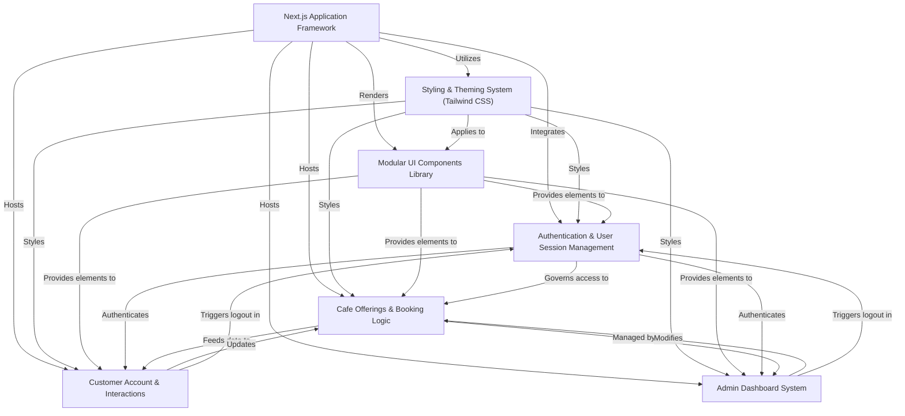
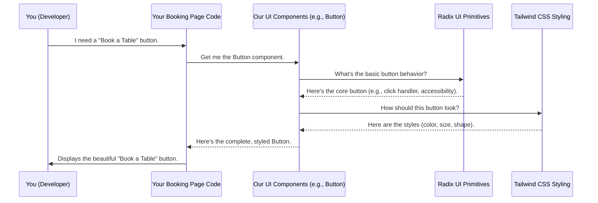
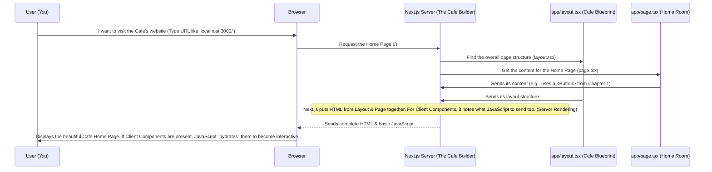
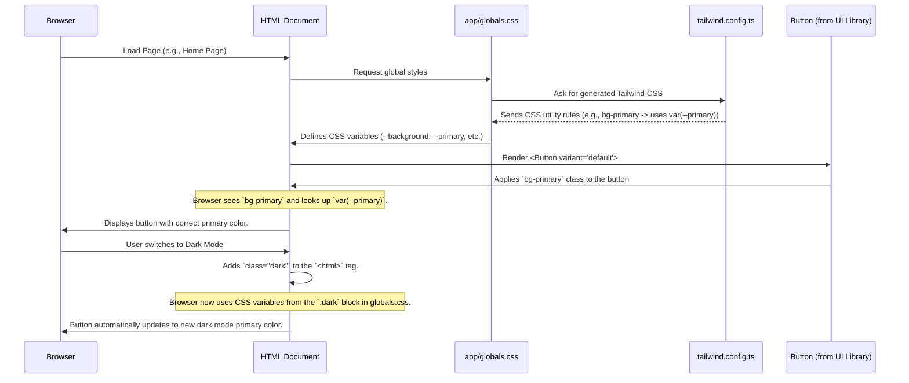
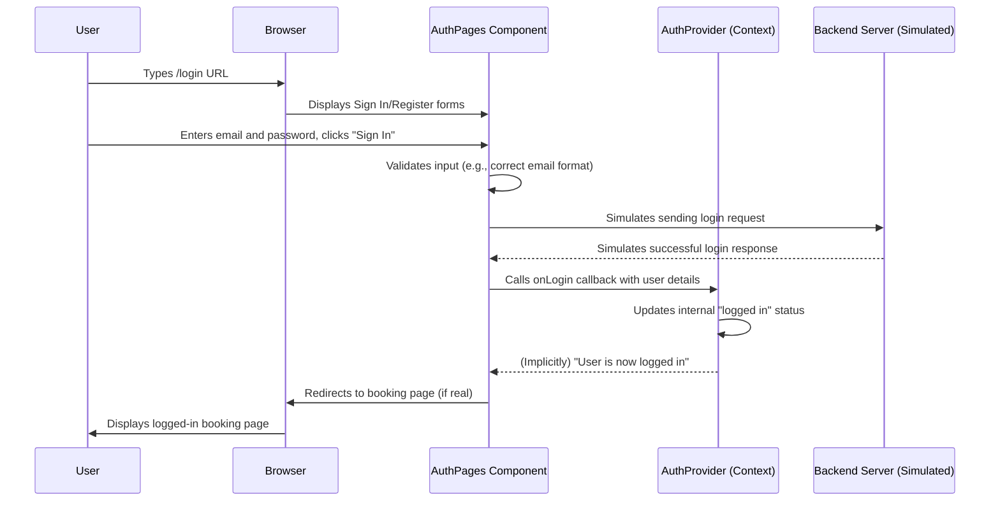
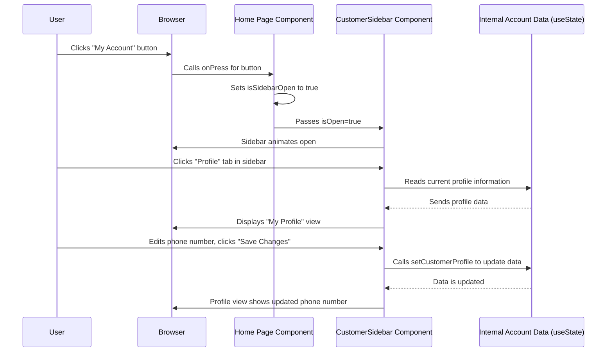
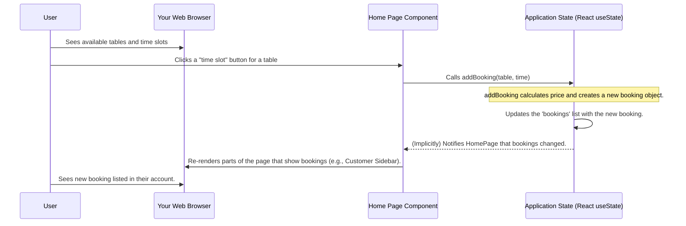
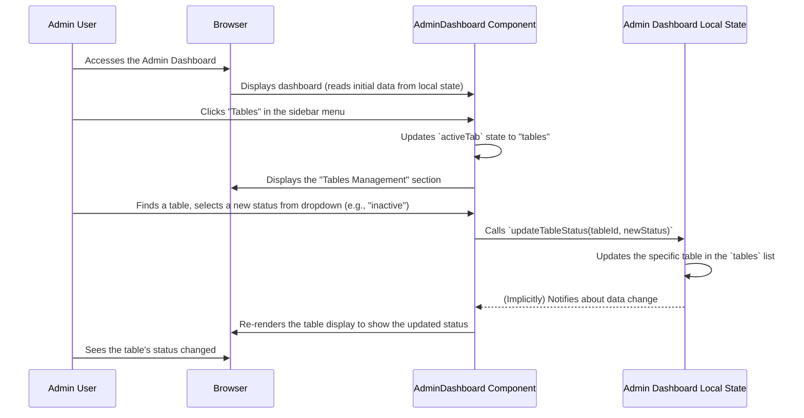

# Tutorial: Cafee-Booking_System

This project, `Cafee-Booking_System`, is a **user-friendly web application** designed to help customers *easily book tables and private rooms* at a cafe, as well as *order various menu items*. It includes features for customers to manage their personal profiles and view their bookings, alongside a dedicated **admin dashboard** for staff to oversee and manage cafe operations like inventory and reservations.


## Visual Overview



## Chapters

1. [Modular UI Components Library
](01_modular_ui_components_library_.md)
2. [Next.js Application Framework
](02_next_js_application_framework_.md)
3. [Styling & Theming System (Tailwind CSS)
](03_styling___theming_system__tailwind_css__.md)
4. [Authentication & User Session Management
](04_authentication___user_session_management_.md)
5. [Customer Account & Interactions
](05_customer_account___interactions_.md)
6. [Cafe Offerings & Booking Logic
](06_cafe_offerings___booking_logic_.md)
7. [Admin Dashboard System
](07_admin_dashboard_system_.md)

---

<sub><sup>Generated by [AI Codebase Knowledge Builder](https://github.com/The-Pocket/Tutorial-Codebase-Knowledge).</sup></sub>

# Chapter 1: Modular UI Components Library

Welcome to the first chapter of our Cafee-Booking System tutorial! Have you ever walked into a cafe and noticed how all the tables, chairs, and counter elements seem to fit together perfectly? They often look like they come from the same collection, making the space feel consistent and professional.

Imagine if, every time the cafe wanted to add a new table, they had to design and build it from scratch, picking out wood, cutting it, sanding it, and painting it. That would take a long time and each new table might look slightly different.

In software development, especially when building user interfaces (UI) – everything you see and interact with on a screen – we face a similar challenge. We need buttons, input fields where you type your name, pop-up messages, and many other visual elements. If we build each of these from scratch every single time, our system would take ages to develop, look inconsistent, and be harder to maintain.

This is where a **Modular UI Components Library** comes in! Think of it as our cafe's "furniture catalog" – a comprehensive collection of pre-built, high-quality furniture pieces (UI elements) that are ready to be used. Instead of building buttons, inputs, or dialogs (pop-up windows) from scratch, we simply pick them from our catalog, import them into our project, and arrange them. This saves a lot of time and ensures everything looks and behaves consistently.

## What is a Modular UI Component?

Let's break down the name:

*   **UI (User Interface)**: This is simply everything you see and interact with on a website or app.
*   **Component**: A small, independent, reusable part of the UI. A button is a component, an input field is a component, a pop-up window is a component.
*   **Modular**: It means these components are like LEGO bricks. They are self-contained, work independently, and can be easily combined with other components to build larger, more complex parts of the interface.
*   **Library**: It's a collection or a catalog of these pre-built components.

In our Cafee-Booking system, this library provides standard components like:
*   Buttons to click for "Book Now" or "Login".
*   Input fields to type your name, email, or desired booking time.
*   Dialogs (pop-ups) for confirming actions or showing important messages.
*   Tooltips that appear when you hover over something to give you more information.
*   Toast messages (small notifications that pop up and then disappear).

## How Our Components Are Built: The "Furniture Factory" Analogy

Our components aren't just thrown together; they are crafted carefully using two powerful tools:

1.  **Radix UI Primitives**: Imagine Radix UI as the expert carpenters and engineers who build the **foundations** and **mechanisms** of our furniture pieces. They ensure a chair is stable, a drawer slides smoothly, and a lamp switch works reliably. They focus on the *behavior* and *accessibility* (making sure everyone, including people using screen readers, can use the component). They don't care about the color or style.

2.  **Tailwind CSS**: Now, imagine Tailwind CSS as the interior designers who come in and apply the **styling**. They choose the colors, the fonts, the spacing, the shadows, and how rounded the corners are. They make sure the furniture looks modern, clean, and exactly like it belongs in a stylish cafe. You'll learn more about this in [Styling & Theming System (Tailwind CSS)](03_styling___theming_system__tailwind_css_.md).

So, our **Modular UI Components Library** combines the sturdy, accessible functionality from Radix UI with the beautiful, consistent styling from Tailwind CSS to give us ready-to-use UI "furniture."

## How to Use a UI Component (Example: A Button)

Let's say we want to add a simple "Book a Table" button to our booking page. Without our component library, we'd have to write a lot of HTML and CSS to make it look good and function correctly. But with our library, it's super easy!

First, you'd import the `Button` component:

```typescript
import { Button } from "@/components/ui/button";
// This line brings the Button component into your file.
```

Then, you can use it just like any other HTML element:

```typescript
function BookingPage() {
  return (
    <div>
      {/* Imagine lots of other content here */}
      <Button variant="default" size="lg">
        Book a Table Now!
      </Button>
    </div>
  );
}
// This creates a button that looks nice and is ready to be clicked.
```

**What happens:** When this code runs, a well-styled, interactive button appears on your screen that says "Book a Table Now!". Because it's from our library, it automatically has the right font, size, and hover effects that match the rest of our cafe system's design. The `variant` and `size` options allow us to easily change its appearance without writing any CSS ourselves!

## How a Component Works Under the Hood

Let's trace how our `Button` component gets from our library to your screen.



As you can see, our `ComponentLibrary` acts as the coordinator, combining the fundamental behavior from `RadixUI` with the visual appeal from `TailwindCSS` to deliver a polished, ready-to-use `Button`.

## Diving Deeper: The Code Behind the Components

Let's look at a simplified version of the code for some of these components. Don't worry if all the details don't make sense yet; the goal is to see how Radix UI and Tailwind CSS work together.

### The Button Component (`components/ui/button.tsx`)

This file defines our `Button` component. Notice the `Radix UI` part and how `Tailwind CSS` classes are applied.

```typescript
import * as React from "react"
import { Slot } from "@radix-ui/react-slot" // From Radix UI
import { cva } from "class-variance-authority" // Helps with styling variants

import { cn } from "@/lib/utils" // A helper for combining Tailwind classes

// Defines different styles (variants) and sizes for our button
const buttonVariants = cva(
  "inline-flex items-center justify-center rounded-md text-sm font-medium", // Common styles
  {
    variants: {
      variant: {
        default: "bg-primary text-primary-foreground hover:bg-primary/90", // Tailwind classes for default look
        destructive: "bg-destructive text-destructive-foreground",
        // ... other variants
      },
      size: {
        default: "h-10 px-4 py-2", // Tailwind classes for default size
        sm: "h-9 rounded-md px-3",
        // ... other sizes
      },
    },
    defaultVariants: {
      variant: "default",
      size: "default",
    },
  }
)

const Button = React.forwardRef<HTMLButtonElement, any>(
  ({ className, variant, size, asChild = false, ...props }, ref) => {
    // If 'asChild' is true, it uses Radix UI's Slot to transfer styles/props
    const Comp = asChild ? Slot : "button"
    return (
      <Comp
        // Applies all the Tailwind CSS classes based on variant and size
        className={cn(buttonVariants({ variant, size, className }))}
        ref={ref}
        {...props}
      />
    )
  }
)
Button.displayName = "Button"

export { Button, buttonVariants }
```

**Explanation:**
*   `Radix UI` provides `Slot` which is a super clever component that helps make our `Button` more flexible. It lets us "transfer" its styles and behavior to another component if we need to.
*   `cva` (class-variance-authority) is a library that works with `Tailwind CSS`. It allows us to define different "variants" (like `default`, `destructive`) and "sizes" (like `sm`, `lg`) for our button. When you use `<Button variant="destructive">`, `cva` automatically applies the correct `Tailwind CSS` classes (like `bg-destructive`) to make it red.
*   `cn` is a small helper function that cleverly combines all the `Tailwind CSS` class names you provide, making sure they don't conflict. You'll learn more about `Tailwind CSS` in [Styling & Theming System (Tailwind CSS)](03_styling___theming_system__tailwind_css_.md).

### The Input Component (`components/ui/input.tsx`)

This is simpler, but shows the same idea: a standard HTML `input` element wrapped with consistent `Tailwind CSS` styling.

```typescript
import * as React from "react"
import { cn } from "@/lib/utils" // For combining Tailwind classes

const Input = React.forwardRef<HTMLInputElement, any>(
  ({ className, type, ...props }, ref) => {
    return (
      <input
        type={type}
        // Applies standard Tailwind CSS classes for a clean input look
        className={cn(
          "flex h-10 w-full rounded-md border border-input bg-background px-3 py-2",
          className
        )}
        ref={ref}
        {...props}
      />
    )
  }
)
Input.displayName = "Input"

export { Input }
```

**Explanation:** This component takes a regular `<input>` HTML element and applies a consistent set of `Tailwind CSS` classes (like `border`, `rounded-md`, `bg-background`) to it. This means every input field in our system will look the same and have the correct styling without extra effort.

### Other Components: Dialog, Tooltip, Toast, Form

You'll find similar patterns in other component files:

*   **`components/ui/dialog.tsx`**: This file defines components for pop-up windows. It heavily uses `Radix UI`'s `DialogPrimitive` to handle the complex behavior of opening, closing, and making sure the dialog is accessible. `Tailwind CSS` then styles how it looks.

    ```typescript
    "use client" // Marks this component for client-side rendering

    import * as React from "react"
    import * as DialogPrimitive from "@radix-ui/react-dialog" // From Radix UI
    import { X } from "lucide-react" // An icon library

    import { cn } from "@/lib/utils"

    const Dialog = DialogPrimitive.Root // The main dialog component
    const DialogTrigger = DialogPrimitive.Trigger // What opens the dialog
    const DialogContent = React.forwardRef<any, any>(
      ({ className, children, ...props }, ref) => (
        <DialogPrimitive.Content // Radix UI provides the core content area
          ref={ref}
          // Tailwind CSS classes for positioning, background, shadows, and animations
          className={cn(
            "fixed left-[50%] top-[50%] z-50 grid w-full max-w-lg translate-x-[-50%]",
            className
          )}
          {...props}
        >
          {children}
          {/* Radix UI Close button with Tailwind CSS styling */}
          <DialogPrimitive.Close className="absolute right-4 top-4 rounded-sm opacity-70">
            <X className="h-4 w-4" /> {/* The 'X' icon */}
            <span className="sr-only">Close</span>
          </DialogPrimitive.Close>
        </DialogPrimitive.Content>
      )
    )
    DialogContent.displayName = DialogPrimitive.Content.displayName

    export { Dialog, DialogTrigger, DialogContent } // Simplified export
    ```

*   **`components/ui/tooltip.tsx`**: This handles small informational pop-ups that appear when you hover over something. Again, `Radix UI` provides the core behavior for showing/hiding, and `Tailwind CSS` styles the box.

    ```typescript
    "use client"

    import * as React from "react"
    import * as TooltipPrimitive from "@radix-ui/react-tooltip" // From Radix UI

    import { cn } from "@/lib/utils"

    const TooltipProvider = TooltipPrimitive.Provider
    const TooltipContent = React.forwardRef<any, any>(
      ({ className, sideOffset = 4, ...props }, ref) => (
        <TooltipPrimitive.Content // Radix UI provides the content structure
          ref={ref}
          sideOffset={sideOffset}
          // Tailwind CSS classes for its appearance and animations
          className={cn(
            "z-50 overflow-hidden rounded-md border bg-popover px-3 py-1.5",
            className
          )}
          {...props}
        />
      )
    )
    TooltipContent.displayName = TooltipPrimitive.Content.displayName

    export { TooltipContent, TooltipProvider } // Simplified export
    ```

*   **`components/ui/toast.tsx`**: These are small, temporary messages (like "Booking Confirmed!") that slide in and out. `Radix UI` manages their display and dismissal, and `Tailwind CSS` styles their look.

    ```typescript
    "use client"

    import * as React from "react"
    import * as ToastPrimitives from "@radix-ui/react-toast" // From Radix UI
    import { cva } from "class-variance-authority" // For styling variants

    import { cn } from "@/lib/utils"

    const ToastProvider = ToastPrimitives.Provider
    // Defines different styles for toasts (e.g., default, destructive)
    const toastVariants = cva(
      "group pointer-events-auto relative flex w-full items-center",
      {
        variants: {
          variant: {
            default: "border bg-background text-foreground",
            destructive: "destructive border-destructive bg-destructive",
          },
        },
        defaultVariants: {
          variant: "default",
        },
      }
    )

    const Toast = React.forwardRef<any, any>(
      ({ className, variant, ...props }, ref) => {
        return (
          <ToastPrimitives.Root // Radix UI provides the core toast
            ref={ref}
            className={cn(toastVariants({ variant }), className)}
            {...props}
          />
        )
      }
    )
    Toast.displayName = ToastPrimitives.Root.displayName

    export { Toast, ToastProvider } // Simplified export
    ```

*   **`components/ui/form.tsx`**: This file provides building blocks for creating robust forms (like login forms or booking forms). It integrates with `Radix UI`'s `LabelPrimitive` for accessible labels and helps manage form fields more easily.

    ```typescript
    "use client"

    import * as React from "react"
    import * as LabelPrimitive from "@radix-ui/react-label" // From Radix UI
    import { FormProvider } from "react-hook-form" // Tool for building forms

    import { cn } from "@/lib/utils"
    import { Label } from "@/components/ui/label" // Our custom Label component

    const Form = FormProvider // Main form wrapper
    const FormItem = React.forwardRef<HTMLDivElement, any>(
      ({ className, ...props }, ref) => {
        const id = React.useId() // Generates a unique ID
        return (
          <div ref={ref} className={cn("space-y-2", className)} {...props} />
        )
      }
    )
    FormItem.displayName = "FormItem"

    const FormLabel = React.forwardRef<any, any>(
      ({ className, ...props }, ref) => {
        // 'useFormField()' is a special hook to connect label to input field
        // This ensures accessibility: clicking the label focuses the input.
        return (
          <Label
            ref={ref}
            className={cn("text-sm", className)}
            {...props}
          />
        )
      }
    )
    FormLabel.displayName = "FormLabel"

    export { Form, FormItem, FormLabel } // Simplified export
    ```

In all these examples, you can see a clear pattern: the `*Primitive` parts come from Radix UI, providing the core, accessible functionality. The `className={cn(...)` parts are where `Tailwind CSS` comes in, applying all the visual styles. This separation of concerns makes our components powerful and easy to maintain.

## Conclusion

In this chapter, we've explored the foundational concept of our **Modular UI Components Library**. We learned that it's like a catalog of high-quality, pre-built "furniture pieces" for our cafe booking system's user interface. These pieces are built with the robust, accessible foundations from Radix UI and styled beautifully with Tailwind CSS, ensuring a consistent and efficient development process.

By using this library, we avoid reinventing the wheel and can quickly assemble complex UIs from standardized parts. This sets us up nicely for the next step, where we'll see how these components fit into the larger structure of our application.

Ready to see how our entire cafe booking system is put together? Let's move on to the next chapter: [Next.js Application Framework](02_next_js_application_framework_.md).

---

<sub><sup>Generated by [AI Codebase Knowledge Builder](https://github.com/The-Pocket/Tutorial-Codebase-Knowledge).</sup></sub> <sub><sup>**References**: [[1]](https://github.com/KeenIsHere/Cafee-Booking_System/blob/9b23402e46349577680709a2baaf59ca2ff9add4/components/ui/button.tsx), [[2]](https://github.com/KeenIsHere/Cafee-Booking_System/blob/9b23402e46349577680709a2baaf59ca2ff9add4/components/ui/dialog.tsx), [[3]](https://github.com/KeenIsHere/Cafee-Booking_System/blob/9b23402e46349577680709a2baaf59ca2ff9add4/components/ui/form.tsx), [[4]](https://github.com/KeenIsHere/Cafee-Booking_System/blob/9b23402e46349577680709a2baaf59ca2ff9add4/components/ui/input.tsx), [[5]](https://github.com/KeenIsHere/Cafee-Booking_System/blob/9b23402e46349577680709a2baaf59ca2ff9add4/components/ui/toast.tsx), [[6]](https://github.com/KeenIsHere/Cafee-Booking_System/blob/9b23402e46349577680709a2baaf59ca2ff9add4/components/ui/tooltip.tsx)</sup></sub>

# Chapter 2: Next.js Application Framework

Welcome back to our Cafee-Booking System tutorial! In [Chapter 1: Modular UI Components Library](01_modular_ui_components_library_.md), we learned how to create and use pre-built UI "furniture pieces" like buttons and input fields. We now have a beautiful collection of components that look and behave consistently.

But what do we do with all these individual pieces of furniture? A cafe isn't just a collection of tables and chairs; it's a *building* with a layout, different rooms (the main dining area, the counter, the kitchen), hallways that connect them, and a system for welcoming guests and serving coffee.

This is where the **Next.js Application Framework** comes in. If our UI components are the individual pieces of furniture, then Next.js is like the **architect and the core construction team** for our entire cafe building. It defines the foundational structure, how different "rooms" (pages) are built and connected, and how the overall building operates for visitors (users).

## What Problem Does Next.js Solve?

Imagine you want to build a website for our cafe. You need:
*   A "Home" page to greet visitors.
*   A "Book a Table" page where customers can make reservations.
*   An "Admin Dashboard" page for staff to manage bookings.

How do we make sure these pages exist, how do users move between them, and how does the website efficiently deliver content to people's browsers? Next.js provides the blueprint and tools to manage all of this.

Our central use case for this chapter will be: **How do we create the Home Page of our cafe booking system and enable users to navigate to other pages?**

## Next.js: The Blueprint and Builder

Next.js is a powerful framework built on top of React (which is like the "LEGO bricks" we mentioned in Chapter 1). It takes the complexity of building modern web applications and makes it much simpler.

Let's break down some key concepts Next.js handles:

### 1. Pages and Routing: Your Cafe's Rooms and Hallways

Think of each distinct screen a user sees (like the Home page or the Booking page) as a "room" in our cafe building. Next.js has a very clever way to create these rooms and automatically set up the "hallways" (links) between them.

Instead of manually telling Next.js, "Hey, I want a page at `/book`," you simply create a file in a specific folder structure. This is called **File-system Routing**.

*   **`app` Directory**: In Next.js, all your pages and API routes live inside a special folder called `app/`.
*   **`page.tsx`**: To create a web page, you just make a file named `page.tsx` inside any folder within `app/`.

| File Path             | What it creates        | Analogy                                   |
| :-------------------- | :--------------------- | :---------------------------------------- |
| `app/page.tsx`        | Your Home Page (`/`)   | The main entrance room of the cafe        |
| `app/book/page.tsx`   | The Booking Page (`/book`) | The dedicated booking counter room        |
| `app/admin/page.tsx`  | The Admin Page (`/admin`) | The manager's office room                 |

This system is incredibly intuitive: the folder structure directly maps to the website's addresses (URLs).

### 2. Rendering: How Content is Prepared

When you visit a website, the content you see has to be prepared somewhere. Next.js offers different ways to "render" (prepare and display) your content, helping your cafe's website load super fast and feel responsive.

Imagine preparing a coffee:
*   **Server Components (Default)**: Next.js by default treats your components as "Server Components." This means the content for that part of the page is prepared *at the cafe itself* (on the server) and then the finished view (HTML) is sent to your device. This is like the barista making your coffee behind the counter and handing you a finished cup. It's fast because your device doesn't have to do much work. Great for static content, or pages that need data before they even show up.

*   **Client Components (`"use client"`)**: For parts of your website that need to be interactive (like a booking form where you pick dates from a calendar, or a button that changes text when clicked), Next.js allows you to mark them as "Client Components" by adding `"use client"` at the very top of their file. This means the preparation of that part happens *on your device* (in your browser). It's like the barista giving you a DIY coffee kit – you get the ingredients and mix it yourself. This is necessary for anything that uses browser-specific features or needs to constantly update based on user actions.

Most of your pages will be a mix of both! The overall structure and main content might be Server Components, and interactive elements within them will be Client Components.

### 3. API Routes: The Cafe's Communication System

(We'll cover this more in later chapters like [Authentication & User Session Management](04_authentication___user_session_management_.md) and [Cafe Offerings & Booking Logic](06_cafe_offerings___booking_logic_.md), but it's good to know it exists!)

Just like your cafe's front desk needs to talk to the kitchen to see if a table is available, your website needs to talk to a "backend" (a server that stores data). Next.js allows you to create special "API Routes" (like a secret internal phone line) inside the `app/api/` folder. These routes act as endpoints for your website to send and receive data from your database, for example, to fetch available booking slots or save a new reservation.

## Building Our Home Page with Next.js

Let's use our use case: creating the cafe's Home Page and preparing for navigation.

### The Overall Cafe Structure (`app/layout.tsx`)

Every Next.js application has a main "layout" file that wraps all other pages. Think of this as the main foundation and outer walls of your cafe building – things that are present on *every* page, like the basic HTML structure, shared navigation bar (if any), or overall styling.

```typescript
// File: app/layout.tsx
import type { Metadata } from 'next'
import { GeistSans } from 'geist/font/sans'
import { GeistMono } from 'geist/font/mono'
import './globals.css' // Our main styling file

export const metadata: Metadata = {
  title: 'Cafee Booking System', // This shows in the browser tab!
  description: 'Book your perfect spot at our cozy cafe.',
  generator: 'v0.dev',
}

export default function RootLayout({
  children, // 'children' is where all your other pages go!
}: Readonly<{
  children: React.ReactNode
}>) {
  return (
    <html lang="en">
      <head>
        <style>{`
html {
  font-family: ${GeistSans.style.fontFamily};
  --font-sans: ${GeistSans.variable};
  --font-mono: ${GeistMono.variable};
}
        `}</style>
      </head>
      <body>{children}</body> {/* All your pages will appear here */}
    </html>
  )
}
```
**Explanation:**
*   This file is a "Server Component" by default (no `"use client"`). It defines the basic HTML structure (`<html>`, `<head>`, `<body>`).
*   `metadata` provides information about your website for browsers and search engines.
*   `children` is a special prop from Next.js. Whatever page you're currently visiting (like `app/page.tsx` or `app/book/page.tsx`) will be rendered *inside* where `children` is placed. This is how the overall structure wraps your specific page content.
*   `./globals.css` is where global styles are imported, which we'll explore in [Chapter 3: Styling & Theming System (Tailwind CSS)](03_styling___theming_system__tailwind_css__.md).

### Our Home Page Content (`app/page.tsx`)

Now, let's create the actual content for our main entrance room – the Home Page.

```typescript
// File: app/page.tsx
"use client" // This page uses Client Components

import HomePageWithAuth from "../home-page" // A component that makes up our homepage

export default function Page() {
  return <HomePageWithAuth /> // Displays the content of our homepage
}
```
**Explanation:**
*   The `"use client"` directive at the top tells Next.js that this `Page` component (and `HomePageWithAuth` within it) should be rendered on the client's browser. This is common for pages that have a lot of interactivity.
*   `HomePageWithAuth` would be another React component (likely in a file like `home-page.tsx` at the root of your project or in `components/`). It would contain all the visual elements for your home page, probably using some of those [Modular UI Components](01_modular_ui_components_library_.md) we talked about, like a `<Button>` for "Book a Table."

### Running Your Cafe Website

To actually see your Next.js cafe building in action, you use simple commands. These commands are defined in your `package.json` file.

```json
// File: package.json (simplified relevant part)
{
  "name": "my-v0-project",
  "version": "0.1.0",
  "private": true,
  "scripts": {
    "build": "next build", // Prepares your cafe for deployment
    "dev": "next dev",     // Starts a server for development (like building on site)
    "lint": "next lint",   // Checks code for errors
    "start": "next start"  // Runs your built cafe (for visitors)
  },
  "dependencies": {
    // ... lots of packages for Radix UI, Tailwind CSS, etc.
  },
  "devDependencies": {
    // ... developer tools
  }
}
```
**Explanation:**
*   `npm run dev`: This is what you'll use most often during development. It starts a "development server" that lets you see your changes instantly as you write code. It's like having the construction crew actively building and showing you progress in real-time.
*   `npm run build`: When your cafe is ready for the public, this command creates an optimized version of your website that's super fast and efficient. It's like the final inspection and sealing of your cafe building before opening.
*   `npm run start`: After building, this command runs the optimized version. This is what you'd use on a server that hosts your live cafe website.

### Configuration Files

Next.js projects also come with a few configuration files that are important for the "blueprint":

*   **`tsconfig.json`**: This file is for TypeScript (the language we're using, which adds extra checks to JavaScript to prevent errors). It tells the TypeScript compiler how to understand your project, including special paths like `"@/*": ["./*"]` which lets us import files easily using `@/` at the start, instead of long relative paths like `../../../`. It's like having a standardized system for naming and locating all blueprints within the construction office.

*   **`next.config.mjs`**: This file allows you to customize how Next.js itself behaves. For example, you can tell it how to handle images or if it should ignore certain errors during the build process. It's like having a special section in the main blueprint for custom instructions for the construction team.

## How Next.js Works Under the Hood

Let's trace what happens when a user wants to visit the home page of our Cafee-Booking System:



When you request a page:
1.  Your **Browser** sends a request to the **Next.js Server**.
2.  The **Next.js Server** looks at the requested address (like `/`).
3.  It finds the matching `app/layout.tsx` (the overall blueprint) and `app/page.tsx` (the specific room's content).
4.  Since `app/layout.tsx` is a Server Component, Next.js renders its HTML on the server.
5.  `app/page.tsx` is marked `"use client"`, so Next.js prepares its initial HTML on the server, but also makes a note to send the JavaScript code for it to the browser.
6.  Next.js combines all this HTML and any necessary JavaScript into a single package.
7.  The **Browser** receives this package and immediately displays the HTML. For the parts that are Client Components (like our Home Page), the JavaScript then "activates" them, making them interactive. This process is called "hydration."

This mix of server and client rendering is a key reason why Next.js applications are so fast and good for SEO (Search Engine Optimization).

## Conclusion

In this chapter, we've explored the **Next.js Application Framework**, understanding it as the architectural blueprint and core construction team for our entire Cafee-Booking System. We saw how Next.js helps us organize our code into "rooms" (pages) using file-system routing and how it efficiently delivers content using server and client rendering. We also touched upon the essential project files that Next.js uses to build and run our application.

Now that we have our components and the overall application structure, it's time to make our cafe building look amazing! In the next chapter, we'll dive into how we style our application consistently and beautifully.

Let's move on to the next chapter: [Styling & Theming System (Tailwind CSS)](03_styling___theming_system__tailwind_css__.md).

---

<sub><sup>Generated by [AI Codebase Knowledge Builder](https://github.com/The-Pocket/Tutorial-Codebase-Knowledge).</sup></sub> <sub><sup>**References**: [[1]](https://github.com/KeenIsHere/Cafee-Booking_System/blob/9b23402e46349577680709a2baaf59ca2ff9add4/app/layout.tsx), [[2]](https://github.com/KeenIsHere/Cafee-Booking_System/blob/9b23402e46349577680709a2baaf59ca2ff9add4/app/page.tsx), [[3]](https://github.com/KeenIsHere/Cafee-Booking_System/blob/9b23402e46349577680709a2baaf59ca2ff9add4/next.config.mjs), [[4]](https://github.com/KeenIsHere/Cafee-Booking_System/blob/9b23402e46349577680709a2baaf59ca2ff9add4/package.json), [[5]](https://github.com/KeenIsHere/Cafee-Booking_System/blob/9b23402e46349577680709a2baaf59ca2ff9add4/tsconfig.json)</sup></sub>

# Chapter 3: Styling & Theming System (Tailwind CSS)

Welcome back, future cafe owner! In [Chapter 1: Modular UI Components Library](01_modular_ui_components_library_.md), we learned about our collection of pre-built UI "furniture" like buttons and input fields. Then, in [Chapter 2: Next.js Application Framework](02_next_js_application_framework_.md), we put together the building (our Next.js application) and arranged the rooms (pages) where our furniture will sit.

Now that we have our cafe building and all the furniture, it's time to **decorate it!** Imagine a beautiful cafe – it's not just the tables and chairs, but also the color of the walls, the style of the lighting, the font on the menu, and whether it has a cozy warm glow or a sleek modern feel.

In our Cafee-Booking System, this "decoration" is handled by the **Styling & Theming System**, powered by **Tailwind CSS**. This system ensures that every button, every input field, and every page looks cohesive, professional, and can even change its overall "mood" (like switching between a bright, airy light mode and a calm, chic dark mode).

## What Problem Does Styling & Theming Solve?

Imagine if every time you added a new button to your booking system, you had to manually decide its exact color, size, and how round its corners should be. Not only would this take forever, but some buttons might end up slightly different, making the whole system look messy and unprofessional.

Our central use case for this chapter is: **How do we make sure our "Book a Table" button (and everything else) looks consistently beautiful and can easily switch between light and dark modes?**

## Tailwind CSS: Your Cafe's Interior Designer

Instead of writing custom CSS rules for every single element, Tailwind CSS provides a collection of pre-made "utility classes" that you can directly add to your HTML elements. It's like having an interior designer who gives you exact instructions: "Make this text `font-bold` and `text-blue-500`, add `p-4` padding, and round its corners with `rounded-lg`."

**Why is this helpful?**

| Traditional CSS           | Tailwind CSS                      |
| :------------------------ | :-------------------------------- |
| You define rules: `my-button { color: blue; padding: 16px; }` | You use existing classes: `<button class="text-blue-500 p-4">` |
| Can become messy and inconsistent over time. | Always consistent because you're using pre-defined styles. |
| Making changes means finding and updating CSS files. | Changes are made directly in the HTML, or by updating Tailwind's configuration centrally. |

Let's see a super simple example of styling with Tailwind:

```html
<!-- A simple div styled with Tailwind CSS -->
<div class="bg-indigo-600 text-white p-4 rounded-lg shadow-md">
  Welcome to our stylish Cafe!
</div>
```
**Explanation:**
This `div` (a basic box for content) will have:
*   `bg-indigo-600`: A dark indigo background color.
*   `text-white`: White text.
*   `p-4`: Padding all around (like space inside a box).
*   `rounded-lg`: Large rounded corners.
*   `shadow-md`: A medium shadow, making it pop out.

You write less custom CSS, and your designs are always consistent!

## Theming: Changing the Cafe's Mood (Light & Dark Mode)

Our system takes styling a step further with "theming." This means we can change the entire color palette and overall look of the application with a simple switch, like turning the lights on or off for a different ambiance. This is most commonly seen with light mode and dark mode.

How do we achieve this flexible theming? With **Custom CSS Variables**.

Imagine having two sets of paint buckets: one for "daytime" colors (light mode) and one for "nighttime" colors (dark mode). Instead of painting directly with "blue" or "black," we paint with "main-background-color." Then, we just switch which bucket "main-background-color" points to.

Our system uses this idea to define colors like `--background`, `--primary`, `--foreground`, etc., in our main CSS file. Then, our Tailwind CSS configuration knows how to use these variables.

## How Our Styling & Theming System is Set Up

Let's look at the key files that make this magic happen.

### 1. The Global Style Sheet (`app/globals.css`)

This is the central "paint shop" for our entire cafe. It's where we tell the browser about our base styles and, crucially, define our custom CSS variables for light and dark modes.

```css
/* File: app/globals.css */
@tailwind base;       /* Basic styles Tailwind provides */
@tailwind components; /* Tailwind's component styles */
@tailwind utilities;  /* All the utility classes like bg-blue-500 */

/* Defines our custom colors as CSS variables for Light Mode */
@layer base {
  :root { /* Applies to the main document */
    --background: 0 0% 100%;    /* White background */
    --foreground: 0 0% 3.9%;    /* Dark text color */
    --primary: 0 0% 9%;         /* Primary brand color (dark for light mode) */
    --primary-foreground: 0 0% 98%; /* Text color on primary background */
    --border: 0 0% 89.8%;       /* Border color */
    --radius: 0.5rem;           /* Default rounded corner size */
  }

  /* Defines our custom colors as CSS variables for Dark Mode */
  .dark { /* Applies when the 'dark' class is on the <html> tag */
    --background: 0 0% 3.9%;    /* Dark background */
    --foreground: 0 0% 98%;     /* Light text color */
    --primary: 0 0% 98%;        /* Primary brand color (light for dark mode) */
    --primary-foreground: 0 0% 9%;  /* Text color on primary background */
    --border: 0 0% 14.9%;       /* Darker border color */
  }
}

/* Base styles for all elements, using our variables */
@layer base {
  * {
    @apply border-border; /* All elements have a border color */
  }
  body {
    @apply bg-background text-foreground; /* Body uses our background and text colors */
  }
}
```
**Explanation:**
*   `@tailwind base;`, `@tailwind components;`, `@tailwind utilities;`: These three lines are crucial! They import all the core styles that Tailwind CSS generates based on your configuration.
*   `:root`: This block defines CSS variables for our "light mode" (the default). For example, `--background` is set to a light color.
*   `.dark`: This block defines the *same* CSS variables, but with different values, for our "dark mode." When the `<html>` tag of our web page has the class `dark` applied to it, these variables will override the `:root` ones.
*   `@layer base { ... }`: This ensures our base styles are applied correctly. `body { @apply bg-background text-foreground; }` means our `body` element automatically gets the background and text color defined by our CSS variables (`--background` and `--foreground`).

### 2. The Tailwind Configuration (`tailwind.config.ts`)

This file is like the main "style guide" for Tailwind CSS. It tells Tailwind where to find our components and pages, what custom colors we have, and how to handle features like dark mode.

```typescript
// File: tailwind.config.ts
import type { Config } from "tailwindcss";

const config: Config = {
  darkMode: ["class"], // Tells Tailwind to use the 'dark' class for dark mode
  content: [
    "./pages/**/*.{js,ts,jsx,tsx,mdx}",   // Look for Tailwind classes here
    "./components/**/*.{js,ts,jsx,tsx,mdx}", // Look for Tailwind classes here
    "./app/**/*.{js,ts,jsx,tsx,mdx}",     // Look for Tailwind classes here
    "*.{js,ts,jsx,tsx,mdx}"               // And in the root of the project
  ],
  theme: {
    extend: {
      colors: {
        // Our custom colors, which pull values from our CSS variables!
        background: 'hsl(var(--background))',
        foreground: 'hsl(var(--foreground))',
        primary: {
          DEFAULT: 'hsl(var(--primary))',
          foreground: 'hsl(var(--primary-foreground))'
        },
        border: 'hsl(var(--border))',
        // ... many other colors defined here
      },
      borderRadius: {
        lg: 'var(--radius)', // Uses our --radius variable
        // ... other border radius settings
      },
      // ... other theme extensions for animations, etc.
    }
  },
  // ... other plugins
};
export default config;
```
**Explanation:**
*   `darkMode: ["class"]`: This is super important for our theming! It tells Tailwind CSS that whenever an HTML element (usually the `<html>` tag) has the class `dark`, Tailwind should apply its dark mode styles. This works perfectly with our `.dark` block in `globals.css`.
*   `content`: This tells Tailwind *where* to scan for all the `class="..."` names you're using in your project. It's how Tailwind knows what CSS rules to generate, keeping the final CSS file small.
*   `theme.extend.colors`: This is where we link Tailwind's color names (like `background`, `primary`) to our CSS variables (like `var(--background)`, `var(--primary)`). So, when you use `bg-primary`, Tailwind knows to use the color value from `var(--primary)` in `globals.css`.
*   `borderRadius.lg: 'var(--radius)'`: This allows Tailwind's `rounded-lg` class to use the `--radius` CSS variable, making it easy to change the default roundedness everywhere.

### 3. The PostCSS Configuration (`postcss.config.mjs`)

PostCSS is a tool that helps transform CSS with JavaScript plugins. For Tailwind CSS, it's pretty simple: it just makes sure Tailwind CSS runs correctly. Think of it as a small helper that processes our CSS before it's ready for the browser.

```javascript
// File: postcss.config.mjs
const config = {
  plugins: {
    tailwindcss: {}, // This plugin adds Tailwind CSS to our project
  },
};

export default config;
```
**Explanation:** This small file ensures that Tailwind CSS is properly applied when your project's CSS is processed.

### 4. The Smart Class Combiner (`lib/utils.ts`)

In our [Modular UI Components Library](01_modular_ui_components_library_.md), you saw components like `Button` use a helper function called `cn`. This `cn` function is like a "smart paintbrush" that cleverly combines multiple Tailwind CSS class names without causing conflicts.

```typescript
// File: lib/utils.ts
import { clsx, type ClassValue } from "clsx"
import { twMerge } from "tailwind-merge"

export function cn(...inputs: ClassValue[]) {
  return twMerge(clsx(inputs))
}
```
**Explanation:**
*   `clsx`: This helper library allows you to write conditional class names. For example, `clsx('button', isActive && 'active-button')` would add `active-button` only if `isActive` is true.
*   `twMerge`: This is the real magic for Tailwind! If you accidentally write conflicting classes, like `p-4 p-2`, `twMerge` knows that `p-2` should override `p-4` (because it's more specific or later in the list). It keeps your final class list clean and correct.
*   `cn`: Our `cn` function combines these two. It first processes any conditional classes with `clsx` and then cleans them up with `twMerge`.

## Putting It All Together: Styling Our "Book a Table" Button

Let's revisit our `Button` component from [Chapter 1](01_modular_ui_components_library_.md) and see how our styling system makes it beautiful and themeable.

Recall the simplified `button.tsx` file:

```typescript
// File: components/ui/button.tsx (simplified)
import * as React from "react"
import { cva } from "class-variance-authority" // Helps with styling variants
import { cn } from "@/lib/utils" // Our smart class combiner

// Defines different styles (variants) and sizes for our button
const buttonVariants = cva(
  "inline-flex items-center justify-center rounded-md text-sm font-medium", // Common base styles
  {
    variants: {
      variant: {
        default: "bg-primary text-primary-foreground hover:bg-primary/90", // Uses our 'primary' color from Tailwind
        // ... other variants like 'destructive'
      },
      // ... sizes
    },
    defaultVariants: {
      variant: "default",
      // ... default size
    },
  }
)

const Button = React.forwardRef<HTMLButtonElement, any>(
  ({ className, variant, size, ...props }, ref) => {
    return (
      <button
        // Here, cn combines our component's styles with any custom styles
        className={cn(buttonVariants({ variant, size, className }))}
        ref={ref}
        {...props}
      />
    )
  }
)
Button.displayName = "Button"

export { Button, buttonVariants }
```
**Explanation:**
When you use `<Button variant="default">Book Now!</Button>`:
1.  `buttonVariants({ variant: "default" })` looks up the `default` variant.
2.  It returns the string `"inline-flex ... bg-primary text-primary-foreground hover:bg-primary/90"`.
3.  This string is passed to our `cn` helper function, along with any other `className` you might add.
4.  `cn` combines and cleans these classes.
5.  The `bg-primary` class is applied to the `<button>` element.

**How does `bg-primary` know whether to be dark (for light mode) or light (for dark mode)?**

*   `tailwind.config.ts` has `primary: { DEFAULT: 'hsl(var(--primary))' }`. This tells Tailwind to use the value of the `--primary` CSS variable.
*   `app/globals.css` defines `--primary` differently for `:root` (light mode) and `.dark` (dark mode).
*   If your `<html>` tag does NOT have the `dark` class, `--primary` will be `0 0% 9%` (a dark gray).
*   If your `<html>` tag DOES have the `dark` class, `--primary` will be `0 0% 98%` (a light white).

So, just by adding or removing the `dark` class on the `<html>` tag, our `bg-primary` button automatically switches its color!

## How Our Styling & Theming Works Under the Hood

Let's trace how the styles are applied to our button and how theming works:



## Conclusion

In this chapter, we've brought our Cafee-Booking System to life visually! We explored the **Styling & Theming System** that uses **Tailwind CSS** for efficient, utility-first styling. We learned how `app/globals.css` defines our custom color variables and sets up light and dark modes, and how `tailwind.config.ts` connects Tailwind's classes to these variables. Finally, we saw how the `cn` helper function in `lib/utils.ts` ensures clean and correct application of styles to our modular UI components.

With a beautiful and consistent look, our cafe is almost ready for customers! Next, we'll delve into how users can securely access and interact with our system.

Let's move on to the next chapter: [Authentication & User Session Management](04_authentication___user_session_management_.md).

---

<sub><sup>Generated by [AI Codebase Knowledge Builder](https://github.com/The-Pocket/Tutorial-Codebase-Knowledge).</sup></sub> <sub><sup>**References**: [[1]](https://github.com/KeenIsHere/Cafee-Booking_System/blob/9b23402e46349577680709a2baaf59ca2ff9add4/app/globals.css), [[2]](https://github.com/KeenIsHere/Cafee-Booking_System/blob/9b23402e46349577680709a2baaf59ca2ff9add4/lib/utils.ts), [[3]](https://github.com/KeenIsHere/Cafee-Booking_System/blob/9b23402e46349577680709a2baaf59ca2ff9add4/postcss.config.mjs), [[4]](https://github.com/KeenIsHere/Cafee-Booking_System/blob/9b23402e46349577680709a2baaf59ca2ff9add4/styles/globals.css), [[5]](https://github.com/KeenIsHere/Cafee-Booking_System/blob/9b23402e46349577680709a2baaf59ca2ff9add4/tailwind.config.ts)</sup></sub>

# Chapter 4: Authentication & User Session Management

Welcome back to our Cafee-Booking System tutorial! In [Chapter 1: Modular UI Components Library](01_modular_ui_components_library_.md), we got our beautiful UI "furniture." In [Chapter 2: Next.js Application Framework](02_next_js_application_framework_.md), we built the cafe building itself and its rooms. And in [Chapter 3: Styling & Theming System (Tailwind CSS)](03_styling___theming_system__tailwind_css_.md), we decorated our cafe, making it look cozy and consistent.

Now, imagine our cafe is beautifully decorated and ready, but how do we know who is walking in? Is it a new customer who wants to register for our loyalty program? Or is it a regular who just wants to log in and quickly book their favorite corner table? How do we ensure only *they* can see their past bookings and personal details? And once they're inside, how do we make sure they don't have to show their ID every time they move from the entrance to the booking counter?

This is where **Authentication & User Session Management** comes in! Think of this system as the cafe's dedicated **concierge and security team**.

## What Problem Does Authentication & Session Management Solve?

Our central use case for this chapter is: **How does a customer securely sign in or register to book a table, and how does the system remember they are logged in so they can move around the website freely?**

Without this system, anyone could try to book a table under any name, or worse, see someone else's personal booking information. It’s like a cafe without a front desk – chaos!

## Key Concepts: Concierge and Your Cafe Pass

This system has two main jobs, like two roles in our cafe:

### 1. Authentication: Proving Who You Are (The Concierge)

**Authentication** is the process of *verifying a user's identity*. It's like the concierge at the cafe's entrance checking your ID or looking up your name on the guest list.

*   **Signing In (Login):** For existing customers, they provide something they *know* (like an email and password) to prove they are who they say they are.
*   **Registering (Sign Up):** For new customers, they create a new identity by providing details like their name, email, and a new password. The system then adds them to the "guest list."
*   **Validation:** Just like a concierge might check if your ID is valid, the system checks if the email is in the correct format or if the password is strong enough.
*   **Social Login:** Sometimes, it's easier to use a trusted third-party, like signing in with your Google or Facebook account. This is like the concierge accepting a special pass from a known partner hotel.

### 2. User Session Management: Remembering You're Logged In (The Cafe Pass)

Once you're authenticated, the system needs to remember that you're logged in as you move from page to page. **User Session Management** handles this.

*   **The Cafe Pass Analogy:** After the concierge verifies your identity, they give you a special temporary "Cafe Pass" (like a wristband or a digital key). You don't need to show your ID again as long as you have this pass.
*   **Maintaining Status:** This "pass" tells the system, "Hey, this person is logged in as [User's Name], let them access their bookings!"
*   **Logging Out:** When you're done, you "return" your pass (log out), and the system stops remembering you.

## Our Approach: Building the Login/Registration Experience

In our Cafee-Booking System, the **`AuthPages` component** is where all the magic happens for signing in and registering. It's like the cafe's front desk, handling both new registrations and existing customer logins.

This component uses many of the [Modular UI Components](01_modular_ui_components_library_.md) (like `Input` fields and `Button`s) and is styled beautifully using our [Styling & Theming System (Tailwind CSS)](03_styling___theming_system__tailwind_css_.md).

### Using the `AuthPages` Component

Imagine we have a page in our Next.js application (from [Chapter 2: Next.js Application Framework](02_next_js_application_framework_.md)) that users visit to sign up or log in. This page would use the `AuthPages` component.

Here's how you might see `AuthPages` used:

```typescript
// File: app/login/page.tsx (simplified example)
"use client" // This page is interactive, so it's a Client Component

import AuthPages from "../../components/auth-pages"
import { useAuthContext } from "../../context/use-auth-context"

export default function LoginPage() {
  const { logout } = useAuthContext() // We'll talk about this soon!

  // This function is called when a user successfully signs in
  const handleLoginSuccess = (email: string, password: string) => {
    alert(`Logged in as: ${email}`)
    // In a real app, you'd then save user info and redirect
  }

  // This function is called when a user successfully registers
  const handleRegisterSuccess = (userData: any) => {
    alert(`Account created for: ${userData.email}`)
    // In a real app, you'd then save user info and redirect
  }

  return (
    <AuthPages onLogin={handleLoginSuccess} onRegister={handleRegisterSuccess} />
  )
}
```
**Explanation:**
*   `AuthPages` is imported and placed directly onto our `LoginPage`.
*   We pass `onLogin` and `onRegister` as "props" to `AuthPages`. These are functions that `AuthPages` will call when a user successfully signs in or registers. This allows the `LoginPage` to decide what happens *after* a successful authentication (e.g., show a welcome message, redirect to the booking page).

### How the `AuthPages` Component Works (Behind the Scenes)

The `AuthPages` component (`components/auth-pages.tsx`) handles all the visual elements and user interactions for signing in and registering. It manages different forms and validates the input.

It also uses its own special CSS file (`components/auth-pages.css`) for its unique background and animations, in addition to our main Tailwind CSS styling.

```typescript
// File: components/auth-pages.tsx (simplified)
"use client" // It's interactive, so it's a Client Component

import { useState } from "react"
import CustomButton from "./custom-button" // Our custom button component

export default function AuthPages({ onLogin, onRegister }) {
  const [isSignIn, setIsSignIn] = useState(true) // Controls if we show Sign In or Register form
  const [isLoading, setIsLoading] = useState(false) // Shows loading state
  const [signInForm, setSignInForm] = useState({ email: "", password: "" })
  const [registerForm, setRegisterForm] = useState({ firstName: "", email: "", password: "" })
  const [errors, setErrors] = useState({}) // Stores any validation errors

  // Helper functions to validate user input
  const validateEmail = (email) => { /* ... checks email format ... */ return true }
  const validatePassword = (password) => { /* ... checks password length ... */ return true }

  const handleSignIn = async (e) => {
    e.preventDefault()
    setIsLoading(true)
    const newErrors = {}
    // ... validation logic for sign in form ...
    setErrors(newErrors)
    if (Object.keys(newErrors).length === 0) {
      setTimeout(() => { // Simulate a network request
        onLogin(signInForm.email, signInForm.password) // Call the passed function
        setIsLoading(false)
      }, 1500)
    } else { setIsLoading(false) }
  }

  const handleRegister = async (e) => {
    e.preventDefault()
    setIsLoading(true)
    const newErrors = {}
    // ... validation logic for registration form ...
    setErrors(newErrors)
    if (Object.keys(newErrors).length === 0) {
      setTimeout(() => { // Simulate a network request
        onRegister(registerForm) // Call the passed function
        setIsLoading(false)
      }, 2000)
    } else { setIsLoading(false) }
  }

  return (
    <div className="auth-container">
      {/* Visual background elements */}
      <div className="auth-background">{/* ... animated coffee beans ... */}</div>

      <div className="auth-content">
        <div className="auth-tabs">
          {/* Buttons to switch between Sign In and Register forms */}
          <button className={`auth-tab ${isSignIn ? "active" : ""}`} onClick={() => setIsSignIn(true)}>Sign In</button>
          <button className={`auth-tab ${!isSignIn ? "active" : ""}`} onClick={() => setIsSignIn(false)}>Register</button>
        </div>

        {isSignIn ? (
          <form onSubmit={handleSignIn} className="auth-form">
            {/* Input fields for email and password */}
            <input type="email" value={signInForm.email} onChange={(e) => setSignInForm({ ...signInForm, email: e.target.value })} />
            <input type="password" value={signInForm.password} onChange={(e) => setSignInForm({ ...signInForm, password: e.target.value })} />
            {errors.email && <span className="error-message">{errors.email}</span>}
            <CustomButton name={isLoading ? "Signing In..." : "Sign In"} onPress={() => {}} disabled={isLoading} />
            {/* ... social login buttons ... */}
          </form>
        ) : (
          <form onSubmit={handleRegister} className="auth-form">
            {/* Input fields for registration details */}
            <input type="text" value={registerForm.firstName} onChange={(e) => setRegisterForm({ ...registerForm, firstName: e.target.value })} />
            <input type="email" value={registerForm.email} onChange={(e) => setRegisterForm({ ...registerForm, email: e.target.value })} />
            <CustomButton name={isLoading ? "Creating Account..." : "Create Account"} onPress={() => {}} disabled={isLoading} />
            {/* ... more registration fields and social login buttons ... */}
          </form>
        )}
      </div>

      {isLoading && (
        <div className="loading-overlay">{/* ... coffee cup animation ... */}</div>
      )}
    </div>
  )
}
```
**Explanation:**
*   `useState`: This is a React feature (from Next.js's underlying React framework) that lets components "remember" things. Here, it remembers which form is showing (`isSignIn`), the text typed into the input fields (`signInForm`, `registerForm`), and any error messages (`errors`).
*   `handleSignIn` / `handleRegister`: These functions are called when the user clicks the "Sign In" or "Create Account" button. They first validate the user's input. If everything looks good, they *simulate* talking to a server (using `setTimeout`) and then call the `onLogin` or `onRegister` functions that were passed in from the parent page.
*   `CustomButton`: This is an example of our reusable [Modular UI Components](01_modular_ui_components_library_.md) in action.
*   `.auth-pages.css`: This file contains specific styling for the background and form layout, complementing the general styles from [Chapter 3](03_styling___theming_system__tailwind_css_.md).

### Managing User Sessions with Context

Once a user successfully logs in, how does the rest of the application know they are logged in? We use something called a **Context Provider** for this.

Imagine the cafe manager walking around with a clipboard that lists all currently verified guests. Any staff member can quickly look at the clipboard to know who is who. Our `AuthContext` and `AuthProvider` act like that clipboard.

*   **`AuthContext.Provider`**: This is the "clipboard" that holds the shared information (like whether a user is logged in, or functions like `logout`). We wrap our entire application (or parts of it) with this provider, making the information available to all components inside it.
*   **`useAuthContext()`**: This is how any component (any "staff member") can quickly "look at the clipboard" and access the shared information or functions (like the `logout` function).

Here's a simplified look at the session management setup:

```typescript
// File: context/use-auth-context.tsx
"use client" // This context is used in Client Components

import { createContext, useContext, type ReactNode } from "react"

// What kind of information or functions will our context provide?
interface AuthContextType {
  logout: () => void // A function to log out the user
  // In a real app, this would also include: isLoggedIn: boolean; user: UserInfo | null;
}

// Create the actual context "clipboard"
const AuthContext = createContext<AuthContextType | undefined>(undefined)

interface AuthProviderProps {
  children: ReactNode // This is where our whole application will go
}

// This component "provides" the context values
export function AuthProvider({ children }: AuthProviderProps) {
  const logout = () => {
    // This is a simplified "mock" logout.
    // In a real app, it would clear login tokens, etc.
    alert("Logged out successfully!")
    // You would typically redirect to the login page here too
  }

  // The 'value' prop is what's made available to all wrapped components
  return <AuthContext.Provider value={{ logout }}>{children}</AuthContext.Provider>
}

// This is the "staff member" hook to easily access context values
export function useAuthContext() {
  const context = useContext(AuthContext)
  if (context === undefined) {
    throw new Error("useAuthContext must be used within an AuthProvider")
  }
  return context
}
```
**Explanation:**
*   `AuthContext`: This is the empty "clipboard" template.
*   `AuthProvider`: This is the component that *fills* the clipboard with actual data and functions. In a real app, it would check if the user is already logged in (e.g., by checking for a saved "cafe pass" like a token) and then provide `isLoggedIn: true` and `user: { ... }`.
*   `useAuthContext`: This is a "hook" (a special React function) that components use to read information from the `AuthContext`. If you have a "Logout" button anywhere in your app, you could use `const { logout } = useAuthContext();` and then call `logout()` when the button is pressed.

To make this `AuthProvider` work for our whole application, it would usually wrap around the `children` in our main `app/layout.tsx` file (from [Chapter 2](02_next_js_application_framework_.md)), ensuring all pages have access to authentication information:

```typescript
// File: app/layout.tsx (simplified relevant part)
import { AuthProvider } from '../context/use-auth-context';

export default function RootLayout({ children }) {
  return (
    <html lang="en">
      <body>
        <AuthProvider> {/* Our entire app is now inside AuthProvider */}
          {children} {/* This is where all your pages and components go */}
        </AuthProvider>
      </body>
    </html>
  );
}
```

## How Authentication & Session Management Works Under the Hood

Let's trace a typical user journey through our system:



When you request a page that requires authentication:
1.  The `AuthPages` component is loaded in your **Browser**.
2.  You fill out the **Sign In** or **Register** form.
3.  When you click the button, `AuthPages` first validates your input to make sure it's correct (e.g., email format, password length).
4.  It then *simulates* sending your credentials to a **Backend Server** (in a real application, this is where your identity would be truly verified against a database).
5.  If the simulated login is successful, `AuthPages` calls the `onLogin` (or `onRegister`) function it received.
6.  This function, in turn, interacts with the `AuthProvider` (our central "clipboard"). The `AuthProvider` now knows that a user is successfully logged in.
7.  Any part of your application wrapped by `AuthProvider` can now use `useAuthContext()` to know that the user is logged in and display appropriate content (e.g., a "Welcome, [User]!" message or access to their private bookings).

## Conclusion

In this chapter, we've explored the crucial concepts of **Authentication & User Session Management**. We learned that **Authentication** is about proving who you are (signing in or registering), and **User Session Management** is about remembering that identity as you navigate the application. We saw how the `AuthPages` component handles the visual forms and input validation, and how the `AuthContext` and `AuthProvider` provide a central way to manage a user's logged-in status across our entire Next.js application.

With users able to securely sign in, our cafe system is ready for them to start interacting with their accounts and making reservations!

Let's move on to the next chapter: [Customer Account & Interactions](05_customer_account___interactions_.md).

---

<sub><sup>Generated by [AI Codebase Knowledge Builder](https://github.com/The-Pocket/Tutorial-Codebase-Knowledge).</sup></sub> <sub><sup>**References**: [[1]](https://github.com/KeenIsHere/Cafee-Booking_System/blob/9b23402e46349577680709a2baaf59ca2ff9add4/components/auth-pages.css), [[2]](https://github.com/KeenIsHere/Cafee-Booking_System/blob/9b23402e46349577680709a2baaf59ca2ff9add4/components/auth-pages.tsx), [[3]](https://github.com/KeenIsHere/Cafee-Booking_System/blob/9b23402e46349577680709a2baaf59ca2ff9add4/context/use-auth-context.tsx)</sup></sub>

# Chapter 5: Customer Account & Interactions

Welcome back to our Cafee-Booking System adventure! In [Chapter 1: Modular UI Components Library](01_modular_ui_components_library_.md), we learned about our beautiful UI building blocks. In [Chapter 2: Next.js Application Framework](02_next_js_application_framework_.md), we assembled our cafe building (the website structure). And in [Chapter 3: Styling & Theming System (Tailwind CSS)](03_styling___theming_system__tailwind_css_.md), we made our cafe look stylish and cozy. Finally, in [Chapter 4: Authentication & User Session Management](04_authentication___user_session_management_.md), we set up the "concierge" to securely check in our customers.

Now that a customer has successfully logged in, what happens next? They need a personal space! Imagine you walk into your favorite cafe, and the barista already knows your usual order, remembers your name, and has a loyalty card ready for you. This personalized experience is exactly what the **Customer Account & Interactions** system provides.

## What Problem Does "Customer Account & Interactions" Solve?

Our central use case for this chapter is: **How can a logged-in customer view their past orders, manage their personal profile (like changing their phone number), update their notification settings, or review their upcoming bookings, all in one convenient place?**

Without a dedicated customer account area, our cafe system would feel impersonal. Customers wouldn't be able to easily track their activities, change their preferences, or feel like valued regulars. This system acts like each customer's **dedicated personal assistant or loyalty program portal**.

## Key Concepts: Your Personal Cafe Hub

This system brings together all the personal information and interactive features a customer needs. Think of it as a personalized "hub" or "dashboard" just for them.

Here are the key areas this hub typically includes:

*   **Personal Profile:** This is where customers can see and update their basic information (name, email, phone), profile picture, and maybe even their favorite items or dietary preferences. It's like their personal ID card for the cafe.
*   **Shopping Cart:** A place to see all the coffee, pastries, or merchandise they've selected but haven't bought yet. It's like a shopping basket they carry around.
*   **Past & Upcoming Bookings:** A record of all their table or room reservations, allowing them to review details, and sometimes even modify or cancel them. It's their personal booking diary.
*   **User Settings:** Options to customize their experience, such as notification preferences (email, SMS), language settings, or privacy controls. It's their personalized control panel for the cafe system.

## How to Use It: The `CustomerSidebar` Component

In our Cafee-Booking System, the main interface for "Customer Account & Interactions" is the **`CustomerSidebar` component**. This component appears as a sliding panel, typically from the side of the screen, when a user wants to access their account details.

Imagine a little button on the top right of your cafe website that says "My Account." When you click it, the `CustomerSidebar` gracefully slides into view.

Here's how you might include and control the `CustomerSidebar` in one of your Next.js pages (perhaps on your main `HomePage` after a user logs in):

```typescript
// File: app/page.tsx (or a similar page where CustomerSidebar is used)
"use client" // This page and the sidebar need client-side interactivity

import { useState } from 'react';
import CustomerSidebar from "../components/customer-sidebar";
import CustomButton from "../components/custom-button"; // Our trusty button!

export default function HomePage() {
  const [isSidebarOpen, setIsSidebarOpen] = useState(false); // Controls if sidebar is visible
  const [myCart, setMyCart] = useState([]); // Simulate a customer's cart
  const [myBookings, setMyBookings] = useState([]); // Simulate customer's table bookings
  const [myRoomBookings, setMyRoomBookings] = useState([]); // Simulate customer's room bookings

  // Simple function to simulate logging out
  const handleLogout = () => {
    alert("You have been logged out!");
    setIsSidebarOpen(false); // Close the sidebar on logout
    // In a real app, you'd use useAuthContext().logout() here (from Chapter 4)
  };

  return (
    <div>
      <h1>Welcome to Cafee!</h1>
      <CustomButton name="My Account" onPress={() => setIsSidebarOpen(true)} />

      {/* The CustomerSidebar component */}
      <CustomerSidebar
        isOpen={isSidebarOpen}
        onClose={() => setIsSidebarOpen(false)}
        cart={myCart}
        setCart={setMyCart}
        bookings={myBookings}
        roomBookings={myRoomBookings}
        onLogout={handleLogout}
        // ... (other props like updateCartQuantity, removeBooking etc. are passed too)
        updateCartQuantity={(itemId, qty) => console.log('Update cart', itemId, qty)}
        removeFromCart={(itemId) => console.log('Remove from cart', itemId)}
        updateBookingDuration={(id, dur) => console.log('Update booking', id, dur)}
        removeBooking={(id) => console.log('Remove booking', id)}
        updateRoomBookingDuration={(id, dur) => console.log('Update room booking', id, dur)}
        removeRoomBooking={(id) => console.log('Remove room booking', id)}
      />
    </div>
  );
}
```
**Explanation:**
*   `"use client"`: The `CustomerSidebar` is highly interactive, so it needs to run in the user's browser, making it a "Client Component."
*   `useState(false)`: We use React's `useState` (a feature of Next.js's underlying React framework) to keep track of whether the sidebar should be `open` or `closed`. It starts `false` (closed).
*   `CustomButton`: When the "My Account" button is clicked, we set `isSidebarOpen` to `true`, which makes the sidebar slide into view.
*   `CustomerSidebar` props: We pass information *into* the `CustomerSidebar` (like `isOpen`, `cart`, `bookings`) and functions *out* of it (like `onClose` and `onLogout`) so it can communicate with the rest of the application.

## How "Customer Account & Interactions" Works Under the Hood

Let's trace a customer's journey as they interact with their personal account:



### Diving Deeper: The Code Inside `CustomerSidebar`

The `CustomerSidebar` component (`components/customer-sidebar.tsx`) is a bigger component because it combines many features. However, it uses simple building blocks you've seen before!

**1. Managing Tabs and Visibility:**

The sidebar uses `useState` to control which section (Overview, Cart, Bookings, Profile, Settings) is currently visible, and to show/hide edit forms.

```typescript
// File: components/customer-sidebar.tsx (simplified)
"use client" // This component needs client-side interactivity

import { useState } from "react";

export default function CustomerSidebar({ isOpen, onClose, cart, bookings, roomBookings, onLogout, /* ... other props */ }) {
  const [activeTab, setActiveTab] = useState("overview"); // Which tab is currently selected
  const [showProfileEdit, setShowProfileEdit] = useState(false); // Whether profile edit form is visible

  // ... (data states like customerProfile, customerSettings, passwordForm)

  return (
    <div className={`customer-sidebar ${isOpen ? "open" : ""}`}>
      <div className="sidebar-header">
        <h3>My Account</h3>
        <button className="close-sidebar" onClick={onClose}>✕</button>
      </div>

      <div className="sidebar-nav">
        {/* Buttons to switch tabs */}
        <button className={`nav-btn ${activeTab === "overview" ? "active" : ""}`} onClick={() => setActiveTab("overview")}>Overview</button>
        <button className={`nav-btn ${activeTab === "cart" ? "active" : ""}`} onClick={() => setActiveTab("cart")}>Cart</button>
        {/* ... other tab buttons */}
      </div>

      <div className="sidebar-content">
        {/* Renders content based on activeTab */}
        {activeTab === "overview" && renderOverview()}
        {activeTab === "cart" && renderCart()}
        {activeTab === "bookings" && renderBookings()}
        {activeTab === "profile" && renderProfile()}
        {activeTab === "settings" && renderSettings()}
      </div>

      <div className="sidebar-footer">
        <CustomButton name="Logout" onPress={onLogout} />
      </div>
    </div>
  );
}
```
**Explanation:**
*   The `isOpen` prop (passed from `HomePage`) controls whether the CSS class `open` is added to the sidebar, making it slide into view.
*   `activeTab` state manages which section (`renderOverview()`, `renderCart()`, etc.) is displayed. When you click a navigation button, `setActiveTab` updates this state.
*   The `onClose` function is called when the '✕' button is clicked, telling the `HomePage` to close the sidebar.
*   `CustomButton` is used for the "Logout" action, demonstrating usage of our [Modular UI Components Library](01_modular_ui_components_library_.md).

**2. Managing Customer Data (Profile Example):**

The `CustomerSidebar` holds "state" for the customer's profile and settings. This means it remembers the customer's current details and tracks changes as they type.

```typescript
// File: components/customer-sidebar.tsx (simplified profile state)
import { useState } from "react";

export default function CustomerSidebar(/* ... props ... */) {
  // ... (activeTab and other states)

  // Customer profile state - this is the "official" saved data
  const [customerProfile, setCustomerProfile] = useState({
    name: "John Customer",
    email: "john@example.com",
    phone: "+1 (555) 987-6543",
    avatar: "/placeholder.svg",
  });

  // A temporary state for the form, which users edit
  const [profileForm, setProfileForm] = useState({ ...customerProfile }); // Copy existing data

  const updateProfile = () => {
    setCustomerProfile({ ...profileForm }); // Update the "official" profile with changes from the form
    setShowProfileEdit(false); // Hide the edit form
    alert("Profile updated successfully!"); // Give feedback to the user
  };

  const renderProfile = () => (
    <div className="customer-profile">
      {/* ... display current profile or edit form based on showProfileEdit */}
      {!showProfileEdit ? (
        <div className="profile-view">
          <h5>{customerProfile.name}</h5>
          <p>{customerProfile.email}</p>
          <p>{customerProfile.phone}</p>
          <button onClick={() => setShowProfileEdit(true)}>Edit</button>
        </div>
      ) : (
        <div className="profile-edit">
          <label>Full Name</label>
          <input
            type="text"
            value={profileForm.name}
            onChange={(e) => setProfileForm({ ...profileForm, name: e.target.value })}
          />
          <label>Phone</label>
          <input
            type="tel"
            value={profileForm.phone}
            onChange={(e) => setProfileForm({ ...profileForm, phone: e.target.value })}
          />
          <CustomButton name="Save Changes" onPress={updateProfile} />
          <button onClick={() => setShowProfileEdit(false)}>Cancel</button>
        </div>
      )}
    </div>
  );

  return (/* ... rest of the component */);
}
```
**Explanation:**
*   `customerProfile`: This `useState` variable stores the customer's *current* saved profile details.
*   `profileForm`: This `useState` variable is a *copy* of `customerProfile`. When the user is editing, they are changing `profileForm`. This is a common pattern: you don't update the "official" data until the user clicks "Save."
*   `onChange`: As the user types in an `input` field, the `onChange` event updates the `profileForm`'s `name` or `phone` property.
*   `updateProfile`: When "Save Changes" is pressed, `setCustomerProfile` copies the updated `profileForm` back into `customerProfile`. This makes the new data visible and acts as if it's been "saved." (In a real application, this would also involve sending the data to a server, but that's handled by future chapters.)

**3. Styling the Sidebar:**

The unique sliding and layout of the `CustomerSidebar` is primarily controlled by its dedicated CSS file (`components/customer-sidebar.css`), which works together with our overall [Styling & Theming System (Tailwind CSS)](03_styling___theming_system__tailwind_css_.md).

```css
/* File: components/customer-sidebar.css (simplified) */
.customer-sidebar {
  position: fixed;
  top: 0;
  right: -500px; /* Starts off-screen to the right */
  width: 500px;
  height: 100vh;
  background: white;
  box-shadow: -5px 0 20px rgba(44, 24, 16, 0.2);
  transition: right 0.3s ease; /* Smooth slide animation */
  z-index: 2000;
  display: flex;
  flex-direction: column;
  overflow: hidden;
}

.customer-sidebar.open {
  right: 0; /* Slides into view */
}

.sidebar-header {
  padding: 1.5rem;
  background: #2c1810; /* Dark coffee color */
  color: white;
}

/* ... many other styles for tabs, profile sections, cart items, etc. ... */
```
**Explanation:**
*   `position: fixed` and `right: -500px`: This makes the sidebar float independently of the page content and initially hide it off the right side of the screen.
*   `transition: right 0.3s ease`: This creates a smooth animation when the `right` property changes.
*   `.customer-sidebar.open`: When the `open` class is added (controlled by our `isOpen` state in React), the `right` property changes to `0`, causing the sidebar to slide smoothly into view.
*   The rest of the `customer-sidebar.css` defines specific colors, spacing, and layouts for all the different sections (overview, cart, profile, settings) to make them look distinct and appealing, complementing the core styles from Tailwind.

## Conclusion

In this chapter, we've explored the **Customer Account & Interactions** system, which provides a personalized hub for each logged-in customer. We learned how the `CustomerSidebar` component acts as this central portal, allowing customers to view their profile, track bookings and cart items, and customize their settings. We also saw how `useState` helps manage the dynamic content and user input within this interactive sidebar.

With a dedicated space for each customer, our cafe system is now ready for them to start exploring the menu and making bookings!

Let's move on to the next chapter: [Cafe Offerings & Booking Logic](06_cafe_offerings___booking_logic_.md).

---

<sub><sup>Generated by [AI Codebase Knowledge Builder](https://github.com/The-Pocket/Tutorial-Codebase-Knowledge).</sup></sub> <sub><sup>**References**: [[1]](https://github.com/KeenIsHere/Cafee-Booking_System/blob/9b23402e46349577680709a2baaf59ca2ff9add4/components/custom-button.tsx), [[2]](https://github.com/KeenIsHere/Cafee-Booking_System/blob/9b23402e46349577680709a2baaf59ca2ff9add4/components/customer-sidebar.css), [[3]](https://github.com/KeenIsHere/Cafee-Booking_System/blob/9b23402e46349577680709a2baaf59ca2ff9add4/components/customer-sidebar.tsx)</sup></sub>

# Chapter 6: Cafe Offerings & Booking Logic

Welcome back, future cafe owner! In [Chapter 5: Customer Account & Interactions](05_customer_account___interactions_.md), we made sure our customers have a personalized "hub" to manage their profile and view their activities. They can now securely log in and see their own dedicated space.

But what's a cafe without its delightful **offerings**? And how do customers actually *book* a cozy table or *order* their favorite coffee? This is where the **Cafe Offerings & Booking Logic** system comes in!

Think of this system as the cafe's **central reservation desk and inventory manager**. It's the brain that knows what tables are available, what delicious items are on the menu, and how to correctly process a customer's request to book a spot or add something to their order.

## What Problem Does "Cafe Offerings & Booking Logic" Solve?

Our central use case for this chapter is: **How can a customer see all the available tables, special rooms, and menu items, and then easily select a time to book a table/room or add a coffee to their cart?**

Without this core system, our beautifully designed cafe would just be a nice-looking building with no actual business happening inside! Customers wouldn't know what's available or how to make a purchase or reservation.

## Key Concepts: Our Cafe's Inventory and Rules

This system has two main parts:

### 1. Cafe Offerings: What's on the Menu & What Spaces are There?

This part is like our cafe's **inventory list**. It defines all the things customers can book or buy. In our system, this includes:

*   **Tables:** Different sizes, locations (window, corner), and how many people they can seat (capacity). They also have a price for booking.
*   **Special Rooms:** Private spaces for meetings, study, or private dining. These also have capacity, a per-hour price, and specific amenities (like projectors or whiteboards).
*   **Menu Items:** All the delicious food and drinks, each with a price, description, and sometimes a rating.

We store information about these offerings in lists (or "arrays" in programming terms) right in our code for now.

### 2. Booking & Ordering Logic: The Rules for Reservations and Purchases

This is the "brain" that handles the actual process. It involves:

*   **Checking Availability:** While simple for now (we just show all slots), in a real system, this would involve checking if a table/room is free at a specific time.
*   **Adding to Booking:** When a customer picks a table or room and a time, this logic creates a new "booking" record.
*   **Adding to Cart:** When a customer picks a menu item, this logic adds it to their shopping cart, keeping track of how many they want.
*   **Calculating Price:** It figures out the total cost based on the item's price and quantity/duration.
*   **Managing Quantities/Durations:** Allowing customers to change how many of an item they want, or how long they want a table/room for.
*   **Removing Items:** Letting customers take items out of their cart or cancel bookings.

## How to Use It: Interacting with Cafe Offerings

Our main Home page (`home-page.tsx`), Menu page (`components/menu-page.tsx`), and Rooms page (`components/rooms-page.tsx`) are where customers interact with these offerings. They all rely on the data and logic from our main application state.

### Booking a Table (on Home Page)

On the main home page, customers see a grid of available tables. When they click a time slot, the `addBooking` function is called.

```typescript
// File: home-page.tsx (simplified)

// ... (previous code)

const addBooking = (table, timeSlot, duration = 2) => {
  const booking = {
    id: Date.now(), // Unique ID for the booking
    table,           // The table object
    timeSlot,        // The selected time
    duration,        // How many hours (default 2)
    date: selectedDate,
    totalPrice: table.pricePerHour * duration,
    status: "confirmed",
  }
  setBookings((prevBookings) => [...prevBookings, booking]) // Add to our list of bookings
}

// In the JSX, inside tables-grid section:
{/* ... other table info ... */}
<div className="time-grid">
  {timeSlots.slice(0, 4).map((time) => (
    <button key={time} className="time-slot" onClick={() => addBooking(table, time)}>
      {time}
    </button>
  ))}
</div>
```
**What happens:** When a customer clicks a `time-slot` button, the `addBooking` function is triggered. It gathers the `table` information and the `time` they clicked, calculates the `totalPrice`, and then updates the `bookings` list (`setBookings`). This makes the new booking appear in their [Customer Account & Interactions](05_customer_account___interactions_.md) sidebar.

### Ordering a Menu Item (on Menu Page)

On the Menu page, each item has an "Add to Cart" button. When clicked, it uses the `addToCart` function.

```typescript
// File: components/menu-page.tsx (simplified)

interface MenuPageProps {
  cart: any[]
  setCart: (cart: any[]) => void // We receive setCart as a 'prop'
}

export default function MenuPage({ cart, setCart }: MenuPageProps) {
  const addToCart = (item) => {
    setCart((prevCart) => {
      const existingItem = prevCart.find((cartItem) => cartItem.id === item.id)
      if (existingItem) {
        return prevCart.map((cartItem) =>
          cartItem.id === item.id ? { ...cartItem, quantity: cartItem.quantity + 1 } : cartItem,
        )
      }
      return [...prevCart, { ...item, quantity: 1 }]
    })
  }

  return (
    // ... (rest of the menu page JSX)
    <CustomButton name="Add to Cart" onPress={() => addToCart(item)} />
  )
}
```
**What happens:** When the "Add to Cart" button is pressed, `addToCart` checks if the item is already in the `cart`. If it is, it just increases the `quantity`. If it's a new item, it adds it to the `cart` with a quantity of `1`. The updated `cart` is then visible in the [Customer Account & Interactions](05_customer_account___interactions_.md) sidebar.

### Booking a Special Room (on Rooms Page)

Similar to tables, the Rooms page allows booking special rooms.

```typescript
// File: components/rooms-page.tsx (simplified)

interface RoomsPageProps {
  roomBookings: any[]
  setRoomBookings: (bookings: any[]) => void // Receive setRoomBookings
}

export default function RoomsPage({ roomBookings, setRoomBookings }: RoomsPageProps) {
  const addRoomBooking = (room, timeSlot, duration = 2) => {
    const booking = {
      id: Date.now(), // Unique ID
      room,            // The room object
      timeSlot,
      duration,
      date: selectedDate,
      totalPrice: room.pricePerHour * duration,
      status: "confirmed",
      type: "room",
    }
    setRoomBookings((prevBookings) => [...prevBookings, booking]) // Add to list
  }

  return (
    // ... (rest of the rooms page JSX)
    <button className="time-slot" onClick={() => addRoomBooking(room, time)}>
      {time}
    </button>
  )
}
```
**What happens:** When a customer clicks a time slot for a room, `addRoomBooking` creates a new room booking object and adds it to the `roomBookings` list. This is then reflected in the customer's account.

## How "Cafe Offerings & Booking Logic" Works Under the Hood

The core of this system, in our current setup, is how data (like tables, menu items) is stored and how user actions (like "Book Now" or "Add to Cart") update our application's "state" (the current information being remembered).

### Step-by-Step Flow: Booking a Table

Here's how it works when you try to book a table:



When you click on a time slot, the `HomePage` component calls the `addBooking` function. This function then updates the `bookings` state in React. When a state changes, React (the engine behind Next.js) automatically re-renders the parts of the page that depend on that state, like the [Customer Account & Interactions](05_customer_account___interactions_.md) sidebar, to show the new booking.

### Diving Deeper: The Code and Data

Let's look at the simplified code that makes this work, focusing on the `home-page.tsx` file since it manages all these pieces of state.

**1. Defining Our Offerings (Data):**

Our cafe's tables, rooms, and menu items are defined as JavaScript arrays of objects.

```typescript
// File: home-page.tsx (simplified table data)
const tables = [
  {
    id: 1,
    name: "Window Table for 2",
    capacity: 2,
    image: "...",
    pricePerHour: 15,
  },
  {
    id: 2,
    name: "Cozy Corner Booth",
    capacity: 4,
    image: "...",
    pricePerHour: 25,
  },
  // ... more tables
]

const timeSlots = [
  "8:00 AM", "9:00 AM", // ... and so on
]
```
**Explanation:** Each object in the `tables` array represents a single table with its unique `id`, `name`, `capacity`, `image` (for display), and `pricePerHour`. `timeSlots` is a simple list of available times. Similar arrays exist for `rooms` (in `components/rooms-page.tsx`) and `menuItems` (in `components/menu-page.tsx`).

**2. Managing Bookings and Cart (State):**

The core of our booking and ordering system relies on React's `useState` to keep track of what the customer has booked or added to their cart. This happens in `home-page.tsx`.

```typescript
// File: home-page.tsx (simplified)
"use client" // This component uses interactive features

import { useState } from "react"

function HomePage() {
  const [bookings, setBookings] = useState([])     // Stores all table bookings
  const [roomBookings, setRoomBookings] = useState([]) // Stores all room bookings
  const [cart, setCart] = useState([])             // Stores all menu items in cart

  // ... (rest of the component)
}
```
**Explanation:**
*   `bookings`, `roomBookings`, and `cart` are variables that hold lists of items. Initially, these lists are empty (`[]`).
*   `setBookings`, `setRoomBookings`, and `setCart` are special functions provided by `useState`. Whenever we want to *change* the `bookings`, `roomBookings`, or `cart` lists, we *must* use these `set` functions. This tells React to update the displayed content.

**3. The Logic for Adding Bookings and Items:**

Let's revisit the `addBooking` and `addToCart` functions, simplified:

```typescript
// File: home-page.tsx (simplified addBooking)
const addBooking = (table, timeSlot, duration = 2) => {
  const booking = {
    id: Date.now(), // A quick way to get a unique ID
    table,
    timeSlot,
    duration,
    date: selectedDate,
    totalPrice: table.pricePerHour * duration,
    status: "confirmed",
  }
  setBookings((prevBookings) => [...prevBookings, booking]) // Add new booking to the list
}

// File: components/menu-page.tsx (simplified addToCart)
const addToCart = (item) => {
  setCart((prevCart) => {
    const existingItem = prevCart.find((cartItem) => cartItem.id === item.id)
    if (existingItem) {
      // If item already exists, increase its quantity
      return prevCart.map((cartItem) =>
        cartItem.id === item.id ? { ...cartItem, quantity: cartItem.quantity + 1 } : cartItem,
      )
    }
    // If new item, add it with quantity 1
    return [...prevCart, { ...item, quantity: 1 }]
  })
}
```
**Explanation:**
*   **`addBooking`**: This function takes the selected `table` and `timeSlot`. It then creates a new `booking` object, assigning it a unique `id` (using `Date.now()` which returns a number representing the current time, making it unique enough for this example). Crucially, it calculates `totalPrice`. Finally, `setBookings` is called. The `(prevBookings) => [...prevBookings, booking]` part is a common React pattern: it takes the *old* list of bookings (`prevBookings`) and creates a *new* list by adding the `booking` to it. React needs a *new* list to detect a change and update the display.
*   **`addToCart`**: This function is a bit smarter. It first checks if the `item` being added is *already* in the `cart`.
    *   If `existingItem` is found, it uses `map` to go through the `prevCart` list. When it finds the existing item, it creates a *new* item object with an increased `quantity` and keeps the rest of the items as they are. This ensures a new list is returned.
    *   If the item is *not* found, it simply adds the new `item` to the `prevCart` with a `quantity` of `1`, again creating a new list.

**4. Other Logic (Update and Remove):**

The system also includes functions like `updateBookingDuration`, `removeBooking`, `updateCartQuantity`, and `removeFromCart`. These functions work similarly: they take an `id` or a new value, create a *new* version of the `bookings`, `roomBookings`, or `cart` array (either by filtering out an item or mapping to a new version of an item), and then call the corresponding `set` function to update the application's state.

For example, a simplified `removeBooking` function:

```typescript
// File: home-page.tsx (simplified removeBooking)
const removeBooking = (bookingId) => {
  setBookings((prevBookings) => prevBookings.filter((booking) => booking.id !== bookingId))
}
```
**Explanation:** This function uses the `filter` method to create a *new* list of bookings that *excludes* the booking with the matching `bookingId`.

It's important to remember that in this initial version of our `Cafee-Booking_System`, all this data (tables, rooms, menu items, and the customer's `bookings`, `roomBookings`, and `cart`) is managed directly within the user's web browser using React's `useState`. This means if the user closes their browser, this data is lost. In a real-world system, this information would be stored permanently in a database on a server, which we'll touch upon more in the [Admin Dashboard System](07_admin_dashboard_system_.md) chapter.

## Conclusion

In this chapter, we've brought the heart of our cafe to life by exploring the **Cafe Offerings & Booking Logic** system. We learned how our application defines its inventory of tables, rooms, and menu items. More importantly, we understood how the core logic for making reservations (`addBooking`, `addRoomBooking`) and adding items to a cart (`addToCart`) works by updating the application's "state" using React's `useState` hooks. We also briefly touched on how bookings and cart items can be removed or updated.

Now that our customers can view offerings and make bookings, it's time to give the cafe staff a powerful tool to manage everything behind the scenes!

Let's move on to the next chapter: [Admin Dashboard System](07_admin_dashboard_system_.md).

---

<sub><sup>Generated by [AI Codebase Knowledge Builder](https://github.com/The-Pocket/Tutorial-Codebase-Knowledge).</sup></sub> <sub><sup>**References**: [[1]](https://github.com/KeenIsHere/Cafee-Booking_System/blob/9b23402e46349577680709a2baaf59ca2ff9add4/components/menu-page.css), [[2]](https://github.com/KeenIsHere/Cafee-Booking_System/blob/9b23402e46349577680709a2baaf59ca2ff9add4/components/menu-page.tsx), [[3]](https://github.com/KeenIsHere/Cafee-Booking_System/blob/9b23402e46349577680709a2baaf59ca2ff9add4/components/rooms-page.css), [[4]](https://github.com/KeenIsHere/Cafee-Booking_System/blob/9b23402e46349577680709a2baaf59ca2ff9add4/components/rooms-page.tsx), [[5]](https://github.com/KeenIsHere/Cafee-Booking_System/blob/9b23402e46349577680709a2baaf59ca2ff9add4/home-page.css), [[6]](https://github.com/KeenIsHere/Cafee-Booking_System/blob/9b23402e46349577680709a2baaf59ca2ff9add4/home-page.tsx)</sup></sub>

# Chapter 7: Admin Dashboard System

Welcome back, future cafe owner! In [Chapter 6: Cafe Offerings & Booking Logic](06_cafe_offerings___booking_logic_.md), we brought the heart of our cafe to life, allowing customers to browse menu items, see available tables, and make bookings. Our customers are now happily reserving spots and ordering delicious coffee!

But what about *you*, the cafe owner or manager? How do you keep track of all those tables, update the menu when you get new ingredients, add a new private room, or see all the incoming bookings? Running a cafe isn't just about serving customers; it's also about managing everything behind the scenes.

This is where the **Admin Dashboard System** comes in! Think of it as the cafe's **control room or back office**. It's a specialized, restricted area designed only for cafe administrators (like you!) to manage and oversee all business operations.

## What Problem Does the Admin Dashboard System Solve?

Our central use case for this chapter is: **How can cafe administrators efficiently manage tables, menu items, rooms, and customer bookings, as well as monitor overall business performance from a single, secure interface?**

Without an Admin Dashboard, managing a busy cafe would be a nightmare. You'd have no easy way to:
*   Add a new "Chef's Special" to the menu.
*   Mark a table as "out of service" for cleaning.
*   See who booked which table at what time.
*   Track overall revenue from bookings.

The Admin Dashboard provides all the tools needed to keep the cafe running smoothly behind the scenes.

## Key Concepts: Your Cafe's Control Panel

This system is your powerful "remote control" for the entire cafe. It has several key areas:

1.  **Centralized Management:** Everything an administrator needs is in one place, organized into different sections (tabs). No more jumping between different tools!
2.  **Resource Management (CRUD Operations):**
    *   **C**reate: Add new tables, menu items, or rooms.
    *   **R**ead: View details of existing tables, menu items, rooms, and bookings.
    *   **U**pdate: Edit details (like a table's capacity or a menu item's price) or change a booking's status.
    *   **D**elete: Remove old menu items or tables that are no longer in use.
    This is like managing your cafe's inventory and physical space.
3.  **Booking Oversight:** A clear list of all customer bookings, allowing you to confirm, cancel, or mark them as completed. This is like your reservation book, but digital and super efficient.
4.  **Business Insights (Overview):** Quick statistics on how your cafe is performing, like total tables, number of active bookings, or total revenue. This is your "business health report."
5.  **Admin Profile & System Settings:** Manage your own administrator account and configure general cafe settings (like opening hours, tax rates, or notification preferences). This is like managing the cafe's rulebook and your staff ID.

## How to Use It: Accessing the `AdminDashboard`

In our Cafee-Booking System, the `AdminDashboard` component is the main interface for administrators. It's typically accessed via a secure login, often on a separate URL like `/admin` (which we briefly touched on in [Chapter 2: Next.js Application Framework](02_next_js_application_framework_.md)).

Here's how a simplified admin page (`app/admin/page.tsx`) would use the `AdminDashboard` component:

```typescript
// File: app/admin/page.tsx
"use client" // This dashboard is highly interactive, so it's a Client Component

import AdminDashboard from "../components/admin-dashboard" // Import the dashboard component
// import { useAuthContext } from "../context/use-auth-context" // From Chapter 4

export default function AdminPage() {
  // In a real application, you'd check if the user is an admin here
  // const { logout, userRole } = useAuthContext();
  // if (userRole !== 'admin') { return <p>Access Denied</p>; }

  const handleAdminLogout = () => {
    alert("Admin Logged out!")
    // In a real app, this would redirect to the login page
    // logout(); // Use logout function from AuthContext (Chapter 4)
  }

  return <AdminDashboard onLogout={handleAdminLogout} />
}
```
**Explanation:**
*   `"use client"`: The `AdminDashboard` involves lots of user interaction (forms, buttons, live updates), so it needs to run in the user's browser as a Client Component.
*   `AdminDashboard`: This is the main component that contains all the dashboard's features.
*   `onLogout`: We pass a function to the dashboard that will be called when the admin clicks the "Logout" button. In a real system, this would use the `logout` function from our [Authentication & User Session Management](04_authentication___user_session_management_.md) system.

## How the Admin Dashboard System Works Under the Hood

The `AdminDashboard` component is quite comprehensive, combining many concepts we've learned so far. It uses React's `useState` (from Next.js's underlying React framework) to manage what's displayed and to keep track of all the cafe's data.

### Step-by-Step Flow: Updating a Table's Status

Let's trace what happens when an administrator updates the status of a table:


When an admin changes a setting or updates data, the `AdminDashboard` component manages these changes locally within its own state. When this local state (`useState` variables) is updated, React automatically re-renders the necessary parts of the dashboard to reflect the changes.

### Diving Deeper: The Code and Data

Let's look at some simplified parts of the `components/admin-dashboard.tsx` file and its accompanying `components/admin-dashboard.css` file.

**1. Initial Data & State Management:**

The dashboard starts with some "mock" (example) data for tables, menu items, rooms, and bookings. In a real application, this data would be fetched from a database. Each piece of data, and the forms used to edit them, are managed using `useState`.

```typescript
// File: components/admin-dashboard.tsx (simplified)
"use client"

import { useState } from "react"
// ... (imports for CustomButton and CSS)

// Initial example data (in a real app, this comes from a database)
const initialTables = [
  { id: 1, name: "Window Table for 2", capacity: 2, pricePerHour: 15, status: "active" },
  { id: 2, name: "Cozy Corner Booth", capacity: 4, pricePerHour: 25, status: "active" },
  // ... more table data
]

const initialMenuItems = [
  { id: 1, name: "Signature Espresso Blend", price: 4.5, status: "active" },
  // ... more menu data
]

// ... initialRooms and initialBookings data

export default function AdminDashboard({ onLogout }) {
  const [activeTab, setActiveTab] = useState("overview") // Controls which section is visible
  const [tables, setTables] = useState(initialTables) // Stores all tables
  const [menuItems, setMenuItems] = useState(initialMenuItems) // Stores all menu items
  const [rooms, setRooms] = useState(initialRooms) // Stores all rooms
  const [bookings, setBookings] = useState(initialBookings) // Stores all bookings
  const [editingItem, setEditingItem] = useState(null) // Holds item being edited
  const [showAddForm, setShowAddForm] = useState(false) // Controls add form visibility

  // Form states for adding/editing (e.g., for tables)
  const [tableForm, setTableForm] = useState({
    name: "", capacity: "", location: "", amenities: "", pricePerHour: "", image: "", status: "active",
  })

  // ... other form states (menuForm, roomForm) and adminProfile, settings
```
**Explanation:**
*   `useState("overview")`: This sets the default section to display when the dashboard loads. When you click a sidebar button, `setActiveTab` changes this value.
*   `useState(initialTables)`: This initializes the `tables` data with our example `initialTables` array. `setTables` is the function we'll use to update this list. Similarly for `menuItems`, `rooms`, and `bookings`.
*   `useState({})`: Form states like `tableForm` hold the values that the administrator types into the input fields when adding or editing an item.

**2. CRUD Operations (Example: Tables):**

The `AdminDashboard` contains functions for each CRUD operation (Create, Read, Update, Delete) for different resources. These functions modify the `useState` variables, triggering updates to the displayed content.

```typescript
// File: components/admin-dashboard.tsx (simplified CRUD for Tables)

  // Add a new table
  const addTable = () => {
    const newTable = {
      id: Date.now(), // Unique ID
      name: tableForm.name,
      capacity: Number.parseInt(tableForm.capacity),
      // ... other table properties from tableForm
      status: tableForm.status,
    }
    setTables([...tables, newTable]) // Add new table to the list
    resetTableForm() // Clear the form
    setShowAddForm(false) // Hide the form
  }

  // Update an existing table
  const updateTable = () => {
    setTables(
      tables.map((table) =>
        table.id === editingItem.id // Find the table we're editing
          ? { // Create a new object for the updated table
              ...table, // Keep existing properties
              name: tableForm.name,
              capacity: Number.parseInt(tableForm.capacity),
              // ... update other properties
              status: tableForm.status,
            }
          : table, // Keep other tables unchanged
      ),
    )
    resetTableForm()
    setEditingItem(null) // Stop editing
  }

  // Delete a table
  const deleteTable = (id) => {
    setTables(tables.filter((table) => table.id !== id)) // Create new list excluding the deleted one
  }

  // Helper to clear the table form
  const resetTableForm = () => {
    setTableForm({ /* ... empty values ... */ })
  }
  // ... (similar functions for menu items, rooms, and bookings)
```
**Explanation:**
*   `addTable`: Creates a new table object using the data from `tableForm` and adds it to the existing `tables` list using `setTables([...tables, newTable])`. This is a common React pattern to create a *new* array, which React then detects as a change and updates the display.
*   `updateTable`: Uses the `map` function to go through the `tables` list. When it finds the table matching `editingItem.id`, it creates a *new* object for that table with the updated information from `tableForm`.
*   `deleteTable`: Uses the `filter` function to create a *new* list of tables that *excludes* the table with the given `id`.
*   These operations for tables are very similar to how we managed cart items and bookings in [Chapter 6: Cafe Offerings & Booking Logic](06_cafe_offerings___booking_logic_.md), but applied to the cafe's core resources.

**3. Displaying Content Dynamically:**

The `AdminDashboard` uses functions like `renderTables()`, `renderMenu()`, etc., to organize the display logic for each section. The `activeTab` state determines which of these functions is called.

```typescript
// File: components/admin-dashboard.tsx (simplified render functions and main return)

  const renderTables = () => (
    <div className="admin-section">
      <div className="section-header">
        <h2>Tables Management</h2>
        <CustomButton
          name="Add New Table"
          onPress={() => {
            setShowAddForm(true) // Show the add/edit form
            setEditingItem(null) // Ensure we're adding, not editing
            resetTableForm()
          }}
        />
      </div>

      {(showAddForm || editingItem) && ( // Show form if adding or editing
        <div className="form-container">
          <h3>{editingItem ? "Edit Table" : "Add New Table"}</h3>
          {/* Input fields for tableForm */}
          <input type="text" placeholder="Table Name" value={tableForm.name} onChange={(e) => setTableForm({ ...tableForm, name: e.target.value })} />
          {/* ... other input fields ... */}
          <div className="form-actions">
            <CustomButton
              name={editingItem ? "Update Table" : "Add Table"}
              onPress={editingItem ? updateTable : addTable} // Call update or add based on context
            />
            <button className="cancel-btn" onClick={() => { setShowAddForm(false); setEditingItem(null); resetTableForm(); }}>
              Cancel
            </button>
          </div>
        </div>
      )}

      <div className="items-grid">
        {tables.map((table) => ( // Loop through tables to display each one
          <div key={table.id} className="item-card">
            
            <div className="item-info">
              <h3>{table.name}</h3>
              <p>Capacity: {table.capacity} people</p>
              <div className={`item-status ${table.status}`}>{table.status}</div>
            </div>
            <div className="item-actions">
              <button className="edit-btn" onClick={() => editTable(table)}>Edit</button>
              <button className="delete-btn" onClick={() => deleteTable(table.id)}>Delete</button>
            </div>
          </div>
        ))}
      </div>
    </div>
  )

  // ... (renderMenu, renderRooms, renderBookings, renderProfile, renderSettings)

  return (
    <div className="admin-dashboard">
      <header className="admin-header">{/* ... Admin Header content ... */}</header>
      <div className="admin-layout">
        <nav className="admin-sidebar">
          <ul>
            <li><button className={activeTab === "overview" ? "active" : ""} onClick={() => setActiveTab("overview")}>📊 Overview</button></li>
            <li><button className={activeTab === "tables" ? "active" : ""} onClick={() => setActiveTab("tables")}>🪑 Tables</button></li>
            {/* ... other navigation buttons ... */}
          </ul>
        </nav>
        <main className="admin-main">
          {activeTab === "overview" && renderOverview()} {/* Only render the active tab's content */}
          {activeTab === "tables" && renderTables()}
          {/* ... other active tab conditions ... */}
        </main>
      </div>
    </div>
  )
}
```
**Explanation:**
*   `renderTables()`: This function returns the JSX (React's way of describing UI) for the Tables Management section. It includes the "Add New Table" button and lists all existing tables.
*   `CustomButton`: Our reusable button component from [Chapter 1: Modular UI Components Library](01_modular_ui_components_library_.md) is used here.
*   `{(showAddForm || editingItem) && (...)`}: This is a conditional rendering trick. The form for adding/editing a table only appears if `showAddForm` is `true` or if an `editingItem` is selected.
*   `tables.map((table) => (...))`: This takes the `tables` array and creates a visual "card" for each table, complete with its image, name, capacity, and current status.
*   The main `return` statement in `AdminDashboard` uses `activeTab === "overview" && renderOverview()` to dynamically display only the content for the currently selected tab.

**4. Styling the Admin Dashboard:**

The `Admin Dashboard` has its own unique look and feel, distinct from the customer-facing side, achieved through `components/admin-dashboard.css`. This CSS works alongside our main [Styling & Theming System (Tailwind CSS)](03_styling___theming_system__tailwind_css_.md) to give it a professional, clear interface suitable for management.

```css
/* File: components/admin-dashboard.css (simplified) */
.admin-dashboard {
  min-height: 100vh;
  background: #f5f5f5; /* Light gray background */
}

.admin-header {
  background: #2c1810; /* Dark coffee color for header */
  color: white;
  padding: 1rem 0;
  box-shadow: 0 2px 10px rgba(0, 0, 0, 0.1);
}

.admin-sidebar {
  width: 250px;
  background: white;
  box-shadow: 2px 0 10px rgba(0, 0, 0, 0.1);
  padding: 2rem 0;
}

.admin-sidebar button {
  width: 100%;
  background: none;
  border: none;
  padding: 1rem 2rem;
  text-align: left;
  color: #2c1810; /* Dark text for sidebar links */
  cursor: pointer;
}

.admin-sidebar button.active {
  background: #d4a574; /* Accent color for active sidebar link */
  color: white;
}

/* ... many other styles for tables grid, forms, stats, etc. ... */
```
**Explanation:**
*   This dedicated CSS file applies specific colors, layouts, and styles (like the `box-shadow` for visual depth or the `background` colors for different sections) that give the Admin Dashboard its clean, organized appearance.
*   It works hand-in-hand with Tailwind CSS. While Tailwind provides utility classes for common styles (like padding, margins, flexbox), `admin-dashboard.css` defines the overall structural layout and unique elements that give the dashboard its distinct visual identity. For example, `admin-sidebar button.active` defines the appearance of the currently selected tab in the sidebar navigation.

## Conclusion

In this final chapter, we've explored the crucial **Admin Dashboard System**, the control center for our entire Cafee-Booking System. We learned how it provides administrators with a centralized, secure interface to manage cafe resources (tables, menu items, rooms), oversee customer bookings, gain business insights, and configure system settings. We saw how React's `useState` is used to manage all the dynamic data and how CRUD (Create, Read, Update, Delete) operations allow full control over the cafe's offerings.

This concludes our journey through the core concepts of the Cafee-Booking System! From modular UI components and the Next.js framework to styling, authentication, customer accounts, cafe offerings, and finally, the powerful admin dashboard, you now have a foundational understanding of how such a system is built.

Thank you for joining this tutorial. We hope you're now ready to build amazing things!

---

<sub><sup>Generated by [AI Codebase Knowledge Builder](https://github.com/The-Pocket/Tutorial-Codebase-Knowledge).</sup></sub> <sub><sup>**References**: [[1]](https://github.com/KeenIsHere/Cafee-Booking_System/blob/9b23402e46349577680709a2baaf59ca2ff9add4/components/admin-dashboard.css), [[2]](https://github.com/KeenIsHere/Cafee-Booking_System/blob/9b23402e46349577680709a2baaf59ca2ff9add4/components/admin-dashboard.tsx)</sup></sub>
